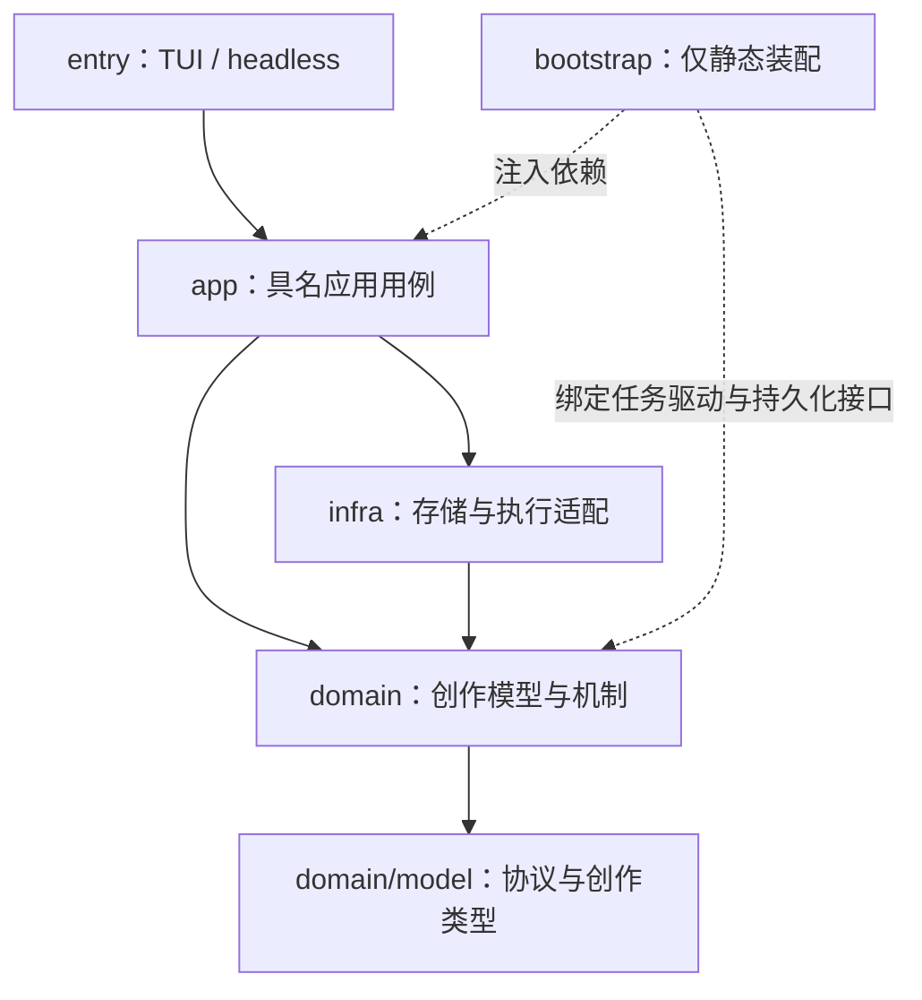

# ainovel-cli v1 架构基线

> 状态：Accepted Core Architecture Baseline（2026-08-18 确立；2026-08-29 修订，见 D23-D32；2026-09-06 修订，见 D33-D37；2026-09-07 修订，见 §0 结构承诺与 §0.5 内核定义、§14、D38–D43；2026-09-08 修订，见 §0.5 三层、§6 执行契约与工件、§6.3 推导契约、§6.4 证据基线、D44–D50；2026-09-09 修订，见 §4.4 故事时间、§5.5/§6.2 提案重定位、§6.4 用户裁决、D51；2026-09-09 内核复审收口，见 D52）
>
> 目标：本文件定义 v1 长期稳定的核心方向、领域边界、不变量与依赖纪律。产品范围、体验、交付阶段和实现状态见 [`product/v1-product-plan.md`](product/v1-product-plan.md)。
>
> 实现位置：无 v0 依赖的实现位于当前仓库 `v1` 分支的根目录。v1 不读取 v0 数据、不复用 v0 实现，也不在当前目录之外建立工作区。
>
> 唯一权威：本文件是 v1 核心架构的唯一裁决来源；其他文档只能引用和落实它，不得覆盖或重新定义核心。v0 在开发期间由 `main` 承载，并由 `v0.x` tags 长期保留；当前分支不复制第二套实现。

文中的“基线”均为当前有效约束，不表示开放建议。如有歧义，以正文不变量与 §15 决策记录为准。实现方便、界面变化或单项产品需求都不能单独成为修改核心的理由。

## 0. 核心目标（任何讨论前先读本节，作为方向的最终裁决依据）

> **用户拥有故事事实，AI 在用户可随时调整的创作边界内，将其想象力持续、可靠地写成完整小说。**

一句话说清 v0 → v1 的本质转变：

> v0 解决的是“能不能自动写出来”；v1 解决的是“写了几十章之后，这本书还归不归用户管；用户随时开口，AI 听不听、听得对不对”。

核心目标拆开是四个承诺，缺任何一个都不算 v1：

1. **所有权归用户**：创作意图、故事事实和最终决定权始终属于用户。AI 越界的变化必须表达为可解释、可审查、可撤销的 Proposal，没有旁路。
2. **边界内 AI 充分自主**：用户锁定的内容 AI 不得静默修改；用户放开的区域 AI 自主创作，不做事事请示的秘书。控制权对用户是可锁、可放、可改、可留的。
3. **目标是完整作品**：长篇失败的根因是错误随章节累积且无法纠正。v1 把“纠正”变成一等操作——任何阶段可改、改前可见影响、改错可回滚——直接服务完本率和长篇质量。
4. **要求是一等对象**：用户在任意时点、任意粒度提出的创作要求——对某一章、对后续章节、对全书，含字数等量化约束——是有作用域、有版本、可核验的正式对象（§4.9）。它不需要先被翻译成事实变更才能被听见，也不需要改代码才能被支持。“用户开口”是 v0 最高频的动作，也是 v0 补丁最集中的地方（§1.1）。

四个承诺落成结构，只有一条：

> **一个内核，两种预设。** 一句话全自动与精细打磨不是两个模式，而是同一内核上的两组边界预设：初始内容多少、锁定范围（locked/guided/open）、审批松紧（auto/milestone/manual）与运行策略。预设在启动时展开为参数，此后系统不再区分它们；用户可以在一本书写作中途连续调节（S9、§5.5、D24）。内核的定义与边界见 §0.5，不允许第二套领域模型、运行协议或状态机。内核必须稳定且精炼：新能力只经 §14 的扩展点进入，内核协议零改动是常态（§0.5）；v1 是彻底重建，没有存量数据，内核里不保留任何迁移阶梯或兼容分支（D38）。

### 0.1 方向校验清单（防跑偏）

后续任何设计决策，先过这五问；任何一问答错，说明方向已偏，回到本节：

1. 这个设计让用户**更拥有**故事，还是只是让系统更自动？自动化程度不是 v1 的升级指标。
2. 用户的这次输入是**事实变更**（有 Diff、影响、版本、可回滚）、**创作要求**（有作用域、版本、核验，见 §4.9），还是又一种换了名字的临时补丁？只有第三种要拒绝。把要求硬翻译成事实变更、或把要求塞进隐藏状态交给一次分诊猜动作，都是补丁的变体——v0 正是这样把每种控制都变成了五层改动。
3. 新需求是靠**调整同一内核的预设**（初始内容多少、锁定范围、审批松紧）来满足，还是又要新增一种“模式”？模式增殖是 v0 的老路。检验标准：从全自动到精细打磨，用户拧的是同一入口上的旋钮，而不是换一套命令；两端之间的每一档都必须走得通——主流用户恰恰活在“全自动为主、偶尔干预”的中间地带，两端通而中间断等于目标用户走不通。
4. 用户跨作品积累的资产（偏好、规则、正反例）是否还在？换一本书是否要从零开始？
5. 这个方案是否引入了对 v0 的任何依赖（代码、数据、行为参照）？v1 与 v0 彻底切断，唯一关系是取代它。

### 0.2 我们在赌什么

v1 不赌“模型不够强”——生成能力是水涨船高的外部变量，不值得投入。v1 赌的是：这类产品的瓶颈在**控制结构**——谁拥有事实、变更如何流转、错误如何纠正。控制结构是产品自己必须建的堤坝，这是 v1 全部投入的理由；反过来，任何“等模型更强就不需要了”的设计都不该做。

这个赌注是假设，不是结论。它的验证方式写在 §0.4：如果控制结构建成后，完本率、返工率和用户要求满足率对 v0 没有可测的改善，说明赌错了方向，应回到本节重议，而不是继续加机制。

### 0.3 目标用户与使用画像

v1 面向个人创作者，本地单机使用，一本书由一个人拥有。主流用户的姿态是**全自动为主、偶尔开口**：给一句话或一份设定让系统写，看到不满意的地方说一句“这章不行”或“接下来这样写”，然后继续让它跑。少数精细打磨的用户会自带大纲、锁定设定、逐章验收；他们决定产品的上限，但不是多数。两类用户使用同一内核；任何设计先问对主流用户是否更轻，再问对精细用户是否够用。多人协作、多租户与云端不在首版画像内（§2.2）。

### 0.4 重构回本的度量

重构的动机是 v0 的每种用户控制都要打穿五层补丁、复杂度上升而效果不好（§1.1）。因此“重构成了”必须可测。以下四项是验收依据，任何一项没有证据都不得宣称 v1 可替代 v0：

1. **控制扩展成本**：新增一种内容要求类的用户控制（§14 三类中的第一类）只走一条标准落法——复用或新增一个权威文档类型（含校验）+ Context Builder 装配 + 裁定核验（+ 可选的确定性校验器）；Coordinator 推导表、Operation Engine 与 Change Engine 的授权规则零改动。由架构测试守护（§14）。
2. **场景覆盖**：S1–S13 全部用真实模型通过，不得由本地假数据宣称通过。
3. **成本**：写作上下文有显式预算；同规模作品的每章输入 token 不高于 v0，且不随章数线性增长。
4. **质量与完成**：完本率、用户否决/返工率、用户要求满足率（裁定核验通过率）与 v0 在同一前提下对照，且不劣于 v0。

### 0.5 内核是什么

内核是两种预设共用的权威、变更、运行和完成契约，以及执行这些契约的确定性机制。内核稳定指的是**协议稳定**：权威唯一、授权明确、提交受控、执行可恢复、完成有证据；不是承载这些职责的代码永不修改。系统分三层（D44）：

| 层 | 内容 | 稳定要求 |
|---|---|---|
| 内核机制 | 版本与授权（§4.7、§5.4）、变更提交（§5）、任务执行与隔离（§6–§6.2）、工件与证据有效性（§6.6、§6.4）、推进驱动（§6.3） | 发布后保持契约兼容；持久化格式或语义变化需显式演进 |
| 创作领域 | 文档类型及其结构、校验、依赖提取（Intent / Plan / Canon / 正文 / 实体 / 附件 / Directive…），在 `domain/model` 内以一张类型登记表声明 | 可增类型，沿用提交算法；跨文档不变量保留为一个函数，不做每类型钩子 |
| 应用编排 | 小说怎样推进、什么算完成（`app/novel/novel_goal.go` 的推导器）、预设与入口 | 随产品演进，共用机制 |

“所有章节写完并通过审阅才完成”是应用规则；“持久化目标、驱动任务、等待裁决、验证证据、记录完成”是内核。确定性代码不一定属于内核。内核机制里的每个抽象都只为真实使用者存在——今天是 LLM 小说执行器与外部生成执行器两族、小说与渲染两种目标——没有第二使用者的机制不写；应用编排层不做成通用框架、工作流引擎或插件系统。

归属判据：一件东西属于内核，当且仅当它是两种预设共用且不可缺的——去掉它，所有权、纠正、完成三者之一就没有保证——并且它不做文学判断。文档类型的具体字段、Prompt、Worker、摘要与检索、界面与导出都不满足这条，它们是扩展面。

内核机制由 `domain/change`、`domain/operation`、`domain/creation` 与 `domain/model` 中的契约承载，`infra/store`、`infra/workspace` 提供持久化与隔离实现。目录不是“纯通用内核”的声明：`domain/model` 仍包含 Intent、Plan、Canon、正文、审阅及小说运行策略，变更校验也包含创作领域不变量。本项目建立的是创作应用的领域内核，不把现有类型伪装成任意媒体的通用框架。是否改变内核契约，仍看权威归属、授权规则、提交前提、执行隔离、生命周期、恢复或完成语义是否改变。

应用用例位于 `app`，具体技术实现位于 `infra`，用户入口位于 `entry`，静态装配位于 `bootstrap`。核心机制声明所需的持久化接口，基础设施实现这些接口；`creation` 声明任务驱动契约，由 `app/task` 绑定执行配置与执行器。源码依赖按此方向组织，不等于运行时调用只能由上向下；允许边界由 `internal/archtest` 白名单测试守护（§12.1）。

产品层与内核的关系只有一种：**一切产品能力都在内核之上、经 §14 的扩展点实现。产品层可以拥有交互状态（焦点、页面、输入草稿、请求状态），但不得形成第二套决定作品版本、审批结果、任务生命周期或完成状态的业务权威，也不得绕过统一变更协议。** 预期变化范围：

| 产品要做的事 | 落在哪 | 预期变化范围 |
|---|---|---|
| 内容要求（这章怎么写、哪些不能动） | 复用或新增权威文档类型 + Context Builder 装配 + 裁定核验（§0.4 第 1 条） | 登记新类型与校验；Coordinator、Operation Engine、Change Engine 授权规则不改 |
| 运行控制（停在第几章、修复预算、候选数） | CreationRun Goal / RunStrategy 的版本化事件 | 调整已有策略值不改协议；新增运行语义可演进 Coordinator 的确定性推导，触及生命周期、恢复或完成契约时记录架构决策 |
| 创作能力（新 Worker、工具、审阅器） | capability | 不触内核 |
| 长篇记忆、上下文预算、检索 | derive / Context Builder | 不触内核 |
| 风格、规则、样本、创作包 | Creator Profile / Overlay / Pack | 不触内核 |
| 界面、命令、导出、配置、诊断 | entry / 只读 Adapter / config | 不触内核 |
| 权威归属、授权规则、提交前提、执行隔离、生命周期、恢复、完成语义 | 内核 | 架构决策（§14、§15） |

Coordinator 不按预设、不按具体控制文档类型、不按文学要求增加分支（D36，架构测试守护），但可以为真实的新运行能力演进。“需要第二条写路径”不是演进选项，是设计审查警报：新能力必须使用统一变更协议。

## 1. 背景与问题定义

v0 最初围绕“一句话生成小说”设计，随后增加共创模式，用多轮对话补充初始需求。两种模式最终仍会把用户意图压缩成一次启动输入，后续创作主要由系统自动推进。两种模式的区别只是交底的详细程度，本质相同：一次性交底，然后失去控制权；沿这条路走下去，每出现一类新需求就要再加一种模式，不可持续。

当作品已经写到几章或几十章后，用户如果希望修改大纲、角色路线、世界规则、结局方向、叙事节奏或写作风格，目前主要依赖 Steer、返工、重写和局部补丁。由此产生几个根本问题：

1. 用户既不是故事状态的一等拥有者，其创作要求也不是一等对象：修改被表达成临时指令，要求被压成一句自然语言交给单次分诊；两者都没有作用域、版本和核验。
2. 计划、已发生事实、用户偏好、模型建议和运行状态边界不够清晰。
3. 快速模式与共创模式只是不同的启动入口，没有形成可持续的创作控制机制。
4. Prompt 与 Agent 执行协议主要由程序内置，用户难以理解、组合和调试最终生成行为。
5. 用户对 AI 正文的长期修改无法稳定沉淀成跨作品复用的个人写作偏好。
6. 新增创作能力通常需要修改 Host、Agent 装配、Prompt、Store 和 UI，用户无法自行扩展。

### 1.1 v0 的实证

v0 仓库的提交史（2026-09-06 考古）证明了问题的量级：每一种用户控制都要穿过 UI、Host、Store、Route/Gate、Arbiter 五层，单项控制一次改 30–80 个文件；用户指令通道换过四种存储形态，“改第 N 章”这一条路径修了六次，最后仍靠熔断硬出队；两种用户控制（逐章验收与“写到第 20 章停”）只能靠后门共存。用户明确提出而 v0 做不到的控制：按章或按条件的事前指令、锁定角色或结局、修改已发生事实、用户自写章节插入、多方案选择、字数等量化约束。

结构性根因五条：

1. 用户意图没有一等领域模型，全部先压成自然语言，再由单次 Arbiter 调用分诊成动作，分类正确性只能靠提示段落堆叠维持；
2. 控制状态散在三处且语义重叠，没有统一的“约束/要求”实体，因此每加一种控制必然同时改 Router、Gate、Arbiter schema、prompt 与 store；
3. 规则只有“注入 prompt”与“字面匹配”两档执行力，凡不能机械检查的需求只能退回自然语言偏好，等于没有强制力；
4. 事实层就地覆盖、无版本无分支，撤销、影响分析、多方案对比在结构上不可能，只能靠事先停住；
5. Router 查不出的一律旁路给 Arbiter，每新增一种控制就在这条旁路上再挖一个特例。

v1 需要解决的不是“怎样让 Agent 更自主”，而是：

> 用户如何在任意时点、任意粒度告诉 AI 想要什么，且这件事不需要改代码；用户如何持续拥有创作意图、故事事实和最终决定权；AI 如何在用户授权的空间内创作，把要求当作必须核验的输入，并把越界变化作为可审查的提案提交。

## 2. 产品北极星

### 2.1 核心承诺

1. **用户拥有故事**：内容相关事实最终由用户决定；系统只拥有运行不变量。
2. **任何阶段都能修改**：从初始规划到写完几十章，用户都能编辑故事并明确选择影响范围。
3. **修改可解释、可撤销**：每次变化都有 Diff、原因、影响分析、作者和版本。
4. **AI 在边界内自主**：用户可以锁定关键节点，也可以把其他区域开放给 AI 发挥。
5. **偏好可以积累**：用户的明确规则、正反例和已确认偏好能够跨作品复用。
6. **能力可以组合**：Prompt、参考资料、规则、模板、评审器和外部能力具有受控扩展点。
7. **失败必须暴露**：冲突、非法扩展、过期修改、Prompt 错误和存储错误都显式失败，不静默回退。
8. **要求被听见并核验**：用户在任意时点、任意粒度提出的创作要求进入正式对象；AI 必须看到它，审阅必须核验它，用户能看到它是否被满足以及为什么没有。

### 2.2 v1 不以什么为目标

1. 不以“Agent 数量更多”作为架构升级指标。
2. 不建立可以任意改写所有状态的万能插件系统。
3. 不在第一阶段实现多租户、分布式调度或多人实时协作。
4. 不兼容 v0 的文件结构与数据，不做导入迁移；v1 与 v0 彻底切断（D12）。
5. 不预先构建通用低代码工作流平台，只实现小说创作所需的持久化 Operation。

## 3. 必须先验证的用户场景

架构讨论必须围绕真实场景展开。以下场景是 v1 的验收基线，不能只靠演示性 Happy Path。

### S1：一句话快速创作

用户输入一句话，系统补全 Intent 和初始 Plan，在自动审批策略下持续创作。快速模式是同一内核的预设，不是独立流程。

### S2：详细需求与用户大纲

用户提供人物设定、世界观、章节大纲或已有材料，可以锁定其中一部分，让 AI 只补全开放区域。

### S3：中途修改未来计划

作品已写 30 章，用户调整第 3 卷结局。系统展示受影响的弧、章节计划、角色路线和伏笔，用户选择“仅影响未来”。

### S4：中途修改已经发生的事实

作品已写 30 章，用户要求修改第 10 章的关键事件。系统识别 Canon 冲突，给出影响报告，用户可选择重写相关章节、只修订后续解释，或放弃本次修改。剧情分支是后续可选能力，不作为首版通过本场景的前提。

### S5：局部控制与局部自由

用户锁定结局、角色底线和几个关键剧情节点，其余章节允许 AI 自主规划和写作。AI 不得静默修改锁定内容。

### S6：修改 Prompt 并验证效果

用户覆盖 Writer 的章节规划策略或 Editor 的评审标准，可以查看最终生效 Prompt、Diff、来源和版本；配置错误时明确失败。

### S7：沉淀个人风格

用户多次修改正文后，系统提出偏好候选。用户确认后保存到全局、题材、系列或本书作用域，并在下一本书中复用。

### S8：安装和分享创作包

用户安装一个题材包，其中包含 Prompt Overlay、规则、参考资料、模板和评测样例，不需要重新编译 ainovel-cli。

### S9：中途改变控制强度

全自动写到第 20 章，用户锁定一个角色设定并把审批调严。收紧立即生效：后续创作在新边界下继续，在途任务受阻时安全暂停等待裁决；整本书的连续创作不中止，用户不需要换命令入口，已写内容与草稿不作废。这是 S1 与 S5 之间的切换缝，也是“同一内核两种预设”成立与否的直接检验。

### S10：拒绝并说明原因

用户拒绝某章草稿并写明理由。理由作为重写任务的输入回流给 AI，重写在同一任务血统下继续；用户不需要理解任务状态机。“这章不行，原因是 X”是 v0 时期用户最高频的干预动作，必须是一等路径。

### S11：章级事前指令

写第 5 章之前，用户说“这章主角要落败，别让他赢”。要求带作用域落为正式对象（§4.9），写作者在该章的上下文里看到它，审阅裁定逐项核验是否满足；用户不需要先把它改写成大纲或设定，也不需要理解它存在哪里。这是 S10 的镜像：S10 是事后说，S11 是事前说，两者同等一等。

### S12：在途要求不打断连续创作

写作进行中，用户插一句“接下来安排反派登场”。要求作用于后续章节并立即入账；当前在途任务的目标不在作用域内时不作废——任务基线只钉住本章的要求作用域，提案按 §5.5 第 4 条重定位到当前 Revision 照常裁决，不重跑模型；下一次任务创建时新要求已生效。作用域与在途任务相交时在途任务标记 stale，后继继承工作区并带上新要求。用户不需要先暂停，也不需要换入口（已实现，D51）。

### S13：量化与结构约束

用户要求“每章 3000 字左右”或“每章结尾留钩子”。可机械校验的部分（字数）由确定性校验器在提交前检查并报告偏差，不满足即回到 Agent 修正；不可机械校验的部分（钩子）进入审阅核验。系统不得把可机械校验的约束降级为“软偏好”。

## 4. v1 核心领域模型

### 4.1 Project

`Project` 是一本作品的权威边界，持有当前版本、内容文档、修订历史、Operation、扩展配置和审批策略。

Creator Profile 和用户维护的 Pack 是跨 Project 资产，拥有各自独立的 Authority Stream 与 Revision，不寄生在任意一本书的 Project Revision 中。Project 只保存启用引用和固定版本；这保证删除、归档或分支一本书不会改变用户的全局创作资产。

### 4.2 Intent

描述用户想创作什么，而不是已经发生了什么：

- 主题与读者体验；
- 必须出现和禁止出现的内容；
- 结局方向；
- 规模、节奏和题材；
- 用户允许 AI 自主决定的范围。

基线：Intent 由用户拥有，AI 可以提出补全或修改 Proposal，但不能直接覆盖。

### 4.3 Plan

描述尚未发生的未来计划：终局、卷、弧、章节节点、角色路线和伏笔计划。

基线：每个结构节点有稳定 ID；标题和顺序可以变化，但引用不依赖数组位置或章节号。

### 4.4 Canon

描述已经被作品确认的事实：已发生事件、角色状态、关系、世界规则和伏笔状态。

基线：Canon 与 Plan 严格分离；修改 Canon 必须产生影响分析，不能被后续规划隐式覆盖。

Canon 节点的键纪律（结构影响平面的地基）：

1. **稳定 ID + 受控词表**：同一概念的事实必须归并到同一节点写入。自由文本键必然发生命名漂移（同一事实被写成多个近义键），跨章依赖链随之断裂，影响分析退化为噪声——这是结构平面成败的第一因素，优先级高于抽取粒度。
2. **写入期结构化**：事实在章节提交时以受控键结构化落账，而不是事后从自由正文抽取再猜键名。
3. **连续性校验**：状态类节点每笔写入携带 old/new，新笔的 old 与上一笔的 new 衔接是零成本的确定性校验；断裂显式报告，这是逮住跨章事实错误（如账目数字不闭合）最便宜的手段。
4. **实体稳定 ID**：角色、地点、物品、组织等实体是独立的权威节点（文档类型 `entity`，有稳定 ID、种类、名称与别名）；Canon 事实的主体引用实体 ID，缺失即被提交拒绝，不使用自由字符串。实体的名称与别名是可修改属性。没有实体 ID，“同一角色”在不同事实里会写成不同主体，第 1 条的归并无从谈起，相关事实检索（§6.5）也做不成确定性查询（D35，已实现）。
5. **依赖边由 Host 记录，读取集与故事依赖分开**：Host 在 Operation 执行期记录两种边，不由模型自行声明，也不接受模型省略。**读取集**是执行实例实际读到的全部输入（含上下文装配），只用于来源追溯与过期判定（§5.5 第 4 条）；**故事依赖**是章节对 Plan/Canon/实体节点的明确引用、该章 Canon Delta 的主客体与来源，以及经确认的关系，在 Proposal 提交时由 Host 写入该章的 depends_on（首版落点：章节计划节点 + 同一 Proposal 中该章 Canon Delta 引用的实体；执行器声明的 depends_on 不作数），读取集首版不记录。结构影响分析只以故事依赖为输入，输出“可能受影响及其依据”，实际冲突由语义检查确认；把整份上下文当作依赖会让任何一条设定改动命中全部章节，影响报告退化成噪声（D35、D40）。

结构化边界必须克制。v1 不试图把全部文学语义转换成 Canon；只有以下内容默认进入结构平面：

- 用户显式声明、锁定或修改的事实；
- 被卷、弧、章节、伏笔或角色路线跨节点引用的事实；
- 角色状态、关系、时间、地点、物品、数值和事件结果等连续性关键事实；
- ChangeSet 明确声明为后续创作约束的内容。

主题、氛围、隐含动机、审美判断和未被提升为约束的文本细节属于语义影响或 Derived Data，不为了追求“全结构化”而进入权威事实图。受控词表约束的是节点类型、关系类型和状态字段，不约束用户可以想象什么；实体使用稳定 ID，名称和别名只是可修改属性。

推荐权威基线：**最新已批准的 Project Revision 是唯一权威版本**。章节正文与该章产生的 Canon Delta 在同一个 ChangeSet 中原子提交；二者发生冲突时不允许任一方静默覆盖另一方，而是显式产生冲突并由用户决定修正方向。Canon 服务于后续生成、结构影响和连续性判断，Manuscript 是正式作品表达，两者必须在 Revision 边界上保持一致。

故事时间与编辑历史是两条轴（D41，已实现）：Project Revision 记录的是编辑顺序，不是剧情顺序。最小契约：

1. 每条事实记录来源章节（`source_chapter_id`）；状态类事实还记录在故事中的生效位置（`effective_chapter_id`，首版为按章号比较的章节，缺省等于来源章；明确的故事时间不做）。AI 提案更新状态类事实时生效位置不得早于现值——插叙、回忆与前传不得因为提交得晚就覆盖“当前状态”，倒叙内容记为事件；用户提案不受此限。
2. 事件记录与当前状态是两类事实：事件按来源章只追加——AI 带正文的提案只能改动来源章在本提案正文集合内的事件；状态按生效位置取最新。
3. 正文被修改或重写后，来源于该章的事实一律待核验。待核验是派生判定、不落字段：事实的最后变化 revision 早于来源章的即待核验（用户编辑、导入、回滚都会触发）；AI 重写章节必须重申报该章全部既有事实（确认、更新或删除，工具边界与提交引擎双重把关），因此不产生待核验。小说推导器把待核验章与未入账章（§4.5）先于任何写作与审阅派发为 `revise_canon` 任务，旧事实不再指导后续创作。
4. old/new 衔接与同事务提交保证的只是记录层的结构一致；正文与事实的语义一致由独立检查（§4.7 第二层、§5.2）提供证据，不由提交本身担保。

AI 随正文提交的事实，来源章必须是本提案的正文之一；规划期事实可以没有来源章。

### 4.5 Manuscript

包括章节正文、草稿、用户修订、评审和版本。

基线：章节具有稳定内容 ID 和版本，不再把文件名或章节号当作唯一身份。

基线：章节正文记录作者（user / ai / extension，必填）。AI 提案中的章节作者必须与提案作者一致，不得冒充用户；用户手写或用户修订过的章节在没有显式 Ownership 规则时按 locked 处理，用户可以显式放开；AI 的重写、审阅触发的重写与影响修复都不得自动覆盖它（D34，已实现）。用户导入的正文可以不带 Canon Delta，但系统必须显式标记“该章事实未入账”，并在下一次上下文装配与审阅中提示补账；不得静默让结构平面对用户章节失明。未入账与待核验（§4.4 第 3 条）是同一机制：没有任何来源事实的章由小说推导器派发 `revise_canon` 补账任务，先于后续写作与审阅（已实现）。

### 4.6 Derived Data

摘要、上下文包、搜索索引、风格统计、相关章节推荐等属于可重建数据。

基线：派生数据不能成为覆盖 Intent、Plan、Canon 或 Manuscript 的权威来源；必须记录基于哪个 Project Revision 生成。

### 4.7 Ownership Policy

内容节点需要表达用户给予 AI 的自由度：

```text
ControlLevel:
  locked    用户锁定，AI 不得自动提交修改
  guided    用户提供可验证约束，AI 可以补充约束外细节
  open      AI 可以在上级边界内自主创作和调整

Lifecycle:
  draft / proposed / accepted / rejected / deprecated

Author:
  user / ai / extension / system
```

控制权、内容生命周期和作者身份是三个正交维度，不能再用一个枚举混在一起。`proposed` 属于生命周期，不属于 Ownership。

`locked` 的准确语义是“禁止 AI 或 Extension 自动提交”，不是“禁止提出建议”：AI 可以生成针对 locked 节点的 Proposal，但该 Proposal 无论当前 Approval Policy 为何都必须由用户显式批准；用户自己提交的修改可以改变 locked 内容。`guided` 必须落成结构化约束或可执行检查，无法机械表达的文学方向只能由语义违规检测辅助，不能假装成确定性权限。

基线：锁定的执行必须拆成两层，不能混为一谈：

1. **确定性写拦截**：对锁定节点的直接修改在 Change Engine 校验层拒绝。零成本、可测试、不依赖模型。
2. **概率性违规检测**：正文在语义上违背锁定内容（例如某章剧情实质改写了锁定的结局）不是对该节点的“写入”，权限系统拦不住，只能靠一致性校验器检测并生成冲突报告。“AI 不得静默修改锁定内容”这条承诺的成色，取决于这一层的检出率。

Ownership 不做隐式写权限继承：锁定 volume/arc 只拦截对该节点本身的直接修改，不把全部后代机械变成 locked；否则局部锁定会退化成整卷 manual。祖先节点中的 locked/guided 内容仍是后代创作的语义约束，自动批准前必须纳入合规检查。用户要锁定整棵子树时，系统生成可见、可审查的批量 Ownership ChangeSet，不用隐藏级联表达（D32）。

第一层的完整规则是：未形成 Proposal 的权威写入一律拒绝；AI/Extension 对 locked 节点的 Proposal 不得自动批准；用户显式批准后，Change Engine 才能提交对应 ChangeSet。

### 4.8 CreationRun（运行对象，非故事事实）

“整本书连续写完”这件事本身需要一个持久化身份：跨进程恢复、中途调整边界、判断何时完成，都挂在它上面。CreationRun 是 Runtime Plane 的运行对象（用户界面可称“连续创作”或“本书创作进度”，不暴露内部名词），引用 Project 而不拥有 Project；**它不是第二套故事或控制权威**，Ownership、审批与 Intent 的唯一权威始终是 Project 最新已批准 Revision。职责、状态语义与完成契约见 §6.3-6.4；具体字段属于对应领域模型和存储实现，不形成第二份架构定义。

### 4.9 Directive（用户创作要求）

Directive 是用户对 AI 提出的正式创作要求，是 Project Authority 中与 Intent、Plan、Canon 并列的一类文档。它回答“用户要什么”；Ownership 回答“AI 不得动什么”；Intent 回答“这本书是什么”。三者正交：Intent 是全书级、一次成形后极少变的目标；Directive 有作用域和生命周期，随写作过程不断新增和退役。

最小结构：

```text
id
scope        project | plan_node:<id> | chapter_range:<from>-<to> | from_chapter:<n>
text         用户原话，不做翻译
constraints  可选的结构化字段，如 target_words / min_words / max_words
status       active | retired
```

基线：

1. **作者只能是用户**。AI 与 Extension 不得创建、修改或退役 Directive；它与 Intent 同属 D25 的无条件确认清单。用户提出要求本身就是确认，不需要向自己申请。
2. **原话保留，不翻译成事实变更**。Directive 不改写 Plan 或 Canon。如果用户的要求实质上是事实变更（“第 10 章 A 其实已经知道秘密了”），产品层引导走 Proposal 与影响分析（S4），而不是把 Directive 当成隐式补丁；两条路径在界面上可以是同一个输入框，在模型上必须是两个对象。
3. **按作用域装配与核验**。命中的 active Directive 列表装入对应 Operation 的 Task（指令平面）：Story Context 是数据块，核心协议规定数据块里的命令式文字不能改变任务，所以 Directive 不走 Story Context；命中集随任务冻结，裁定的覆盖检查与确定性校验才有确定依据。审阅裁定必须对每条命中的 Directive 给出满足 / 未满足声明，与 Intent 核验同构（§6.4）。未满足即阻塞级发现，走既有的重写-再审闭环。
4. **可机械校验的字段由确定性校验器执行**，属于 §4.7 第一层的同类：提交前检查、不满足报告偏差并回到 Agent 修正，修正次数受 RunStrategy 自动修复预算约束（§6.3），预算用尽即等待用户。同一作用域内可机械发现的矛盾（如字数区间不相交）在 Directive 入账时就报告，由用户修改或退役，不交给模型撞墙。不可机械校验的文本只进语义核验；自然语言要求之间的语义冲突不承诺确定性消解，由审阅报告、用户裁决。
5. **Coordinator 零分支**。Directive 只通过 Task 影响创作内容，不改变 Coordinator 的推导表（架构测试守护 `domain/creation/run.go` 不引用任何控制类文档常量）。新增或退役 Directive 是内容变化：章节任务的基线只钉住本章的要求作用域摘要（D48/D51），作用域与在途任务目标不相交时提案重定位、在途任务不 stale；相交时按 §5.5 第 4 条处理，后继继承工作区并按当前快照重算任务输入，带上新要求（已实现）。
6. **退役不删除**。Directive 完成使命后由用户退役，或由作用域自然失效（章范围已全部批准且核验通过）；历史 Revision 仍可查它当时对哪些章生效。

Directive 不是聊天记录，也不是 Overlay 的别名：Overlay 是全书级、长期的创作规则；Directive 有作用域与生命周期，且必须被核验。S10 的拒绝理由在语义上是作用域为被拒章节的 Directive，实现上由否决动作自动创建一条，不另建第二条回流通道。

## 5. 统一变更协议

### 5.1 Proposal

用户、Agent 和 Extension 对任一 Authority Stream（Project、Creator Profile、Pack）的正式变化都先表达为 Proposal。Proposal 只描述“希望发生什么”，不能直接写入权威状态。Agent 在 Operation Workspace 内保存和修改中间草稿不属于 Proposal；只有准备进入 Authority Revision 的候选结果才进入统一变更协议。

用户直接编辑在产品交互上不需要“向自己申请权限”，但内部仍转换成已携带用户批准意图的 Proposal/ChangeSet，以保持版本、影响分析和回滚只有一条写入路径。

### 5.2 Impact Report

影响分析分成两个平面：

1. **结构影响**：根据稳定 ID、依赖和版本由确定性代码计算。
2. **语义影响**：由模型分析角色动机、情节因果、主题和叙事连贯性。

语义分析只能补充影响范围，不能绕过结构校验或直接提交修改。

基线：结构影响必算且同步返回；语义影响按需或异步执行，不阻塞用户操作。交互式修改的每一步都触发完整语义分析会又慢又贵，成本策略是协议设计的一部分，不是实现细节。

这里的“不阻塞”仅指用户浏览和编辑 Proposal 的交互阶段。AI 生成的 Manuscript 如果可能触碰 locked/guided 约束，在自动批准前必须完成最低限度的语义合规检查；检查失败、超时或结果不确定时进入显式待确认状态，不能因为语义分析不可用而自动放行。完整的情节影响分析仍可按需或异步补充。

风险提示：**结构平面的上限就是依赖键稳定性的上限**。Canon 节点与章节之间的依赖图如果键名漂移、链条断裂，Impact Report 就是噪声，“可解释、可审查”的核心承诺随之塌掉。这是 v1 最大的技术赌点，应对分两手：设计上用 §4.4 的键纪律从源头保住键稳定；验证上在垂直切片中用 v1 自产作品闭环检验（见 §13 P1）。

### 5.3 ChangeSet

ChangeSet 是 v1 的核心写入单元，至少包含：

```text
authority_target
base_revision
author
reason
patches
impact_report
approval_state
created_at
```

`authority_target` 明确本次变更写入哪一条权威版本流，例如：

```text
project:<project_id>
creator_profile:<profile_id>/<scope>
pack:<pack_id>
```

基线：首版一个 ChangeSet 只修改一条 Authority Stream，不建设跨 Project/Profile/Pack 的分布式事务。需要联动时由持久化 Operation 编排多个显式 ChangeSet，每一步都可见、可恢复；Execution Profile 只引用已经批准的 Profile/Pack Revision。

基线：所有正式内容变化统一提交 ChangeSet；用户直接编辑、AI 生成、外部文件导入和插件输出不建立旁路。

“回滚”不改写或删除历史 Revision，而是基于目标历史版本生成一个新的反向 ChangeSet。这样审计链保持单调，运行中的 Operation 也能通过 revision 明确判断自己是否过期。

### 5.4 Approval Policy

审批策略用于统一快速、共创和导演式创作：

- `auto`：满足权限和风险条件时自动接受；
- `milestone`：卷、弧、重大 Canon 变化时确认；
- `manual`：所有内容 ChangeSet 都需确认；
- `custom`：按内容类型、作用域和风险配置。

milestone 的判定对象是变化的重大性。例行推进——每章正文与随章提交的 Canon Delta——不构成 milestone；若把例行 Canon Delta 一律判为重大变化，milestone 将塌缩为 manual，中间档随之消失。milestone 只能由三类来源触发：显式卷/弧边界、用户标记的节点、或版本化且可审计的影响分类结果；Writer 不得自行宣称其 Proposal 是否重大，分类不确定时进入用户确认。分类必须是版本化领域契约，Host 内不得散落硬编码的文学语义判断。

无条件确认清单（D25、D31）：**AI 可以在边界内自动创作，不能自动改写自己的边界、指令或可复用资产。** 无论审批策略为何，以下变化都必须用户确认：Intent、Ownership 规则本身、审批策略本身；Project Overlay、Creator Profile、Pack 内容及 Project 固定引用的 Profile/Pack 版本。AI 与 Extension 只能对它们提 Proposal；用户主动编辑、安装、启用、升级或选择预设本身即为确认。

唯一例外是 D28：仅在用户主动发起的初始化事务中，AI 可依所选预设补全缺失的 Intent 字段。初始 Revision 形成后，任何 Intent 变化（含补填空字段）都须用户确认；剧情演进写进 Plan，已发生的写进 Canon，不得借修改 Intent 改变创作目标。

基线：S1 用户在 `auto` 策略下不应感知 Proposal/ChangeSet 机制的存在——机制在幕后完整记录，界面只在需要用户决定时出现。快速模式必须保持“一句话即写”的轻盈，不因机制而变重。该承诺覆盖全部用户可见面，包括失败与等待路径：“用户加锁导致 AI 暂停”是预期行为而不是异常，必须以创作语言呈现（“这一章在等你确认”），不得抛出内部状态与错误术语。术语隐藏不等于隐藏失败：默认以创作语言表达，同时提供可展开的原始错误、Operation 事件与诊断详情。

无人值守创作遇到必须确认的提案时，整个连续创作任务进入可恢复的等待态：已写内容、工作区与上下文全部保留，用户裁决后原地继续；不中止整本创作，不要求用户重新发起。

拒绝是创作反馈，不只是否决：reject 可携带理由，理由必须作为后续重写任务的输入（见 S10）；在语义上它是作用域为该章的 Directive（§4.9），走同一装配与核验路径，不另建第二条回流通道。

### 5.5 控制强度的中途变更

“同一内核的两种预设”成立的前提，是预设之间可以在一本书写作中途连续调节。控制强度变更（增删 locked/guided、调整审批策略）本身是正式的事实变更，走统一变更协议；其生效语义是不对称的：

1. **收紧立即生效**：提交裁决取“Operation 启动快照与最新已批准 Revision 中更严格的一方”。严格序是确定性的：审批 `auto < milestone < manual`，控制 `open < guided < locked`；`custom` 在没有比较契约前继续显式拒绝。“立即生效”指对下一次 Authority 提交生效，不承诺中断已经发出的模型请求。严格序只比较控制级别；同级 guidance 内容变化（如叙事人称从第一人称改为第三人称）不参与大小比较——在途任务同时接受新旧约束校验，二者不兼容或无法判定时进入等待用户裁决，新 Operation 只使用最新规则。Execution Profile 冻结只覆盖 Prompt、工具与模型配置，从不覆盖权限与审批。
2. **放松不追溯**：解锁与调松只作用于新 Operation 或显式 restart，在途任务继续按更严格的一方裁决。
3. **受阻即暂停，不作废**：在途任务因收紧而无法自动继续时转入可恢复的等待态，工作区与已写内容保留；“取消并重启”只能是用户的显式选择，不是系统的默认出路。
4. **等待不惩罚用户**：等待用户裁决的提案不因裁决速度而作废。提案重定位规则（D51，已实现）：提案基线落后于当前 Revision 时，仅当从 base revision 到当前 revision 的每个 ChangeSet 只改过用户专属文档（登记表 `UserOnly`：ownership / approval / overlay / assets / directive / adjudication）、没有碰本提案自己要改的文档，且任务基线（§6.4 D48：章节任务为本章要求作用域摘要，扩窗任务为所依据的窗口裁定基线）在当前 Revision 仍成立时，才确定性把基线搬到当前、重算结构影响并重新裁决（候选内容保留，合规证据须覆盖当前约束）；任何正文、Plan、Entity、Canon 或附件的变化，或相干要求的变化，都不得自动重定位——此时旧 Operation 标记 stale 但保留 Workspace，由 CreationRun 创建继承该工作区的后继 Operation，整本创作不中止。Overlay 与 Assets 是执行配置，按 D20/D48 只作用于新任务，不使在途任务失效。同一条规则用于执行收尾、用户批准与工作台的过期判定；裁定任务不提交内容，只要其基线在当前仍成立即收尾。Directive 的新增与退役按 §4.9 第 5 条：作用域与在途任务目标不相交时不构成过期，相交时同此处理。

## 6. 持久化 Operation Engine

长期操作本身必须持久化，使用户可以查看、暂停、取消、重排和恢复任务。下一步可以由 Coordinator 根据当前事实确定性推导（§6.3），但推导结果必须先持久化为 Operation 才能执行；禁止只存在于内存中的隐式调度循环。

首批 Operation 类型（`domain/model` 内一张种类登记表 `OperationKindSpec`：执行族、是否归属 CreationRun、是否消耗修订预算、进行中的文案、类型化任务输入；各层按类型解码，不各写一份匿名结构，D50）：

```text
InitializeProject   llm
DevelopPlan         llm
WriteChapter        llm
RevisePlan          llm
ReviseCanon         llm
RewriteChapter      llm
RewriteAffected     llm
ReviewRange         llm
GenerateAsset       external   为某文档生成一份衍生工件并以附件挂回权威
InspectAsset        external   核验不可变工件，产出领域检查证据（受控验收实例）
```

每个 Operation 应声明：

- 输入和基线版本；
- 前置条件；
- 允许读取的内容；
- 预期产生的 Outcome 与可选的 Proposal 类型；
- 可恢复步骤；
- 完成条件；
- 失败状态。

Operation 的产出统一表达为 Outcome：`proposal`、`verdict`、`artifacts` 三者至少一项，proposal 与 verdict 互斥，artifacts 可以单独出现或伴随二者之一（D47）。只有需要改变 Authority 时才提交 Proposal；审阅通过就是审阅通过，不得为了满足协议而制造空 Patch（D30）；只产出工件的任务以 succeeded 收尾，不制造空提案。检查证据通过组合根静态装配的 `VerdictContract` 解码和核验；内核只核对契约返回的基线、保存结果并完成归属围栏和恢复。小说审阅与 `inspect_asset` 媒体核验使用同一收尾算法；前者的发现解释与用户裁决属于小说领域，后者的检查结果由对应目标推导器消费。

### 6.1 Operation Workspace

模型工具层读取工件时，将 JSON 内容直接返回为 JSON 对象／数组；`workspace_list` 仅返回 key、version 等元数据，正文通过 `workspace_read` 获取。存储层仍使用字节内容，不改变持久化格式。

章节提交优先采用版本引用：单章传 `workspace_key` 与 `workspace_version`，批量重写传 `workspace_keys` 与 `workspace_versions`（key 到版本的映射）。Host 校验版本后从工作稿装配正文 patch，模型只提交 Canon Delta、实体等附带变更。版本引用不得同时携带 manuscript patch，避免两份正文来源；版本冲突明确拒绝，不静默使用最新稿。生成的 Proposal 继续经过原有章节范围、字数、Canon 和结构校验，不直接写入权威状态。

为兼容已冻结的执行配置，无版本参数的旧式完整正文提交仍可用，并继续要求与工作稿一致。新工具 Schema 区分单章与多章参数；运行时同时传两种键参数会明确报互斥错误。正文不一致时指出 block 和首个差异位置，缺少正文 patch 与内容不一致分别说明。

Operation 必须拥有可持久化但非权威的工作区，用来保存：

- 未完成的章节草稿和结构化候选；
- Agent 工具调用产生的中间工件；
- 基于哪个 Project Revision、Execution Profile 和输入创建；
- 当前步骤、尝试次数、错误和恢复位置；
- 尚未提交的 Proposal 候选。

Agent 可以通过受限工具读写所属 Operation Workspace，但不能直接写 Project Authority Store。`WriteChapter` 可以在工作区内反复写入、按稳定块 ID 修改和校验草稿；完成后只把最终候选提交为 Proposal。`RewriteChapter` 从已批准的 Manuscript Revision 播种独立工作副本，不直接原地修改正式章节。

提交工具是模型唯一能看见校验结果的地方：`proposal_submit` 在工具边界调用 Change Engine 的只读 `Validate`，按提案自身基线执行全部确定性结构校验（事实身份与 old_value、依赖、D41 来源与重申报、规划数量），冲突原样回给模型在同一会话内自纠；收尾的 `PrepareExecution` 只作兜底并处理基线漂移。工具边界不得另写引擎规则的子集。

工具输入的机械装配不改变上述协议：`proposal_submit` 可从 Operation 冻结的 BaseRevision 补齐省略的 Canon `old_value`；`confirm_canon` 明确列出的事实从同一基线复制为确认型 put（old/new 相同），与显式 patches 不得重复。最终 Proposal 仍携带完整旧值并通过所有原有校验，不用最新版本覆盖冻结基线，不自动确认模型未列出的事实，显式错误旧值仍被拒绝。运行时在同一提交工具连续三次出现相同错误后明确失败并保留工作区，避免校验错误陷入无进展循环；不同错误或成功提交重置该工具的计数，普通读写工具不清零。

工作区编辑以 `block_id + expected_workspace_version` 为主要定位和并发前提，不以逐字匹配整段 `old_string` 作为核心协议。Markdown 导出不要求用户看见内部 ID，但显式导入时必须携带基线版本并重建稳定映射；无法唯一定位时明确冲突，不猜测替换位置。

Workspace 解决两个问题：一是中间草稿不污染正式 Revision 历史；二是进程崩溃或模型调用失败后可以从明确步骤恢复，而不是依赖会话记忆重跑。取消 Operation 时默认保留工作区并标记 `cancelled`，由用户显式选择丢弃；不静默删除，也不把半成品伪装成成功结果。

### 6.2 快照、幂等与过期

Operation 创建时固定执行快照（D45）：

```text
executor          执行器身份：族@版本[/路由]，如 llm.agent@1、external.generation@1（LLM 族不带模型路由，见 D57）
base_revision     基线 Project Revision
input_digest      任务输入摘要（= Digest(input)，校验时必须相符）
config_digest     执行配置摘要：LLM 族是 Execution Profile 的内容摘要；外部族是执行器自报的配置摘要
approval_policy   启动时刻的审批策略（追溯记录与最低约束）
```

快照不区分执行族的字段形状：Execution Profile（Worker、核心协议、Prompt 与工具摘要、来源清单）是 LLM 族的配置记录，按内容寻址、同摘要天然幂等，不再对快照自身取摘要。`bootstrap` 通过 `app/task.ExecutorSet` 静态装配 LLM 与 external 两族，按任务族创建、按冻结身份运行；跨执行器领取仍保持全局优先级。领取按 `executor` 相等过滤，执行前核对身份；引擎与推导器都不认识 Prompt Registry。运行中 Prompt、Pack 或 Profile 发生变化，不回头改写当前 Operation 的执行环境。系统把它标记为仍可继续、需要用户重启或已经 stale；不得把新旧配置混入同一次结果。用户希望新配置立即作用于当前任务时，产品执行“取消/保留旧工作区 → 基于新快照重启”的显式操作。

模型绑定（连接、模型、思考强度）不在快照与 Execution Profile 里（D57）：它是 Runtime 的运行时属性，随时可换。队列中的任务在每次 attempt 开始时取当时的绑定；在途 attempt 保持自己的绑定跑完（不迁移配置热修改在途请求），要立刻换只需暂停再继续。每次 attempt 追加 `agent.run_started` 事件记录实际角色、provider、模型、生效思考强度与模型配置摘要，历史由事件解释而不是由快照冻结。

但权限与审批不属于执行环境：提交裁决始终取快照与最新已批准 Revision 中更严格的一方（§5.5），`approval_policy_snapshot` 作追溯记录与最低约束，用户新加的锁对在途任务的后续提交立即可见。

过期（stale）不按“整本 Revision 相等”判定，而按 §5.5 第 4 条的提案重定位规则（D51）：提案先重定位再进入合规分析与裁决，重定位失败即 stale；重定位之后、落库之前又有提交同样转 stale 而非 failed；裁定按基线在当前 Revision 核对。执行快照的 `base_revision` 保持原值作追溯，提案与 ChangeSet 记录重定位后的基线。

每个可产生副作用的步骤使用 `(operation_id, step_id, attempt)` 和幂等键记录。重试可以重复模型计算，但不能重复提交 Proposal、ChangeSet 或派生数据写入；超过重试策略后显式失败，不降级成模板结果或跳过校验。

执行归属是运行不变量（D42）：每次领取递增 attempt，attempt 就是执行实例的围栏令牌。过期或被接替的实例不得再写工作区、不得改变任务状态、不得提交正式内容。归属检查必须与受保护写入原子化：工作区写入、状态收尾与执行侧提交各自在同一事务（或等价的原子条件）内校验当前 attempt；检查与写入分成两步，取消就会落在缝隙里。普通派生缓存（摘要、索引、上下文包）不要求执行围栏，但必须版本隔离：来源 Revision 明确，旧结果不得覆盖新结果或被当作当前结果。派生产出被采纳为任务结果、审批依据或完成证据（如审阅裁定）时，仍须校验执行归属与证据有效性：落盘走执行侧围栏，且只有其 Operation 以当前执行成功收尾后才算证据；旧执行的结果可留作诊断，不得未经检查影响当前运行。幂等解决的是重复执行，替代不了归属检查。取消与提交的顺序也是确定的：用户取消先完成，之后的收尾与提交被拒绝；提交先完成，取消不追溯删除已提交内容，只结束任务。这条规则面向单机多进程，不引入分布式协调。进程退出（界面退出、终止信号）时在途执行收到取消：执行器停手，引擎用脱离取消的短上下文把任务放回 `queued` 并释放租约（记 `operation.transitioned` 事件；不算失败、不计重开预算），下次进入接着对话与工作区续跑；崩溃仍由租约到期回收，同一任务过期次数达到上限（`MaxLeaseExpiries`）才判失败，attempt 只作围栏不作计数。

外部异步任务（D46）不加新状态：执行器在租约内先把请求记录（`external.request` 工作区工件：Operation、attempt、RequestID、提交时间，以及目标/执行器/输入/来源快照/配置身份）落盘，再向外部服务提交；崩溃或租约过期后的下一次执行按记录里的 RequestID 查询而不是重提；服务不认识该请求时以同一 ID 重提；服务不支持恢复或查询超时时以失败码 `result_unknown` 失败，不自动重试。用户动作零新 API：对账 = Resume（failed → queued，仍按 ID 查询）；重提 = Restart（后继继承请求记录；身份相同才先恢复一次，输入、来源快照或配置不同则使用新 ID；仍未知时按用户明确决定换新 ID 重提）。失败码随下一次状态变化清空。

一次 LLM 调用只有一个重试策略拥有者，禁止 provider、agent loop 和 Operation 三层叠加重试。网络/限流等可重试错误由统一分类器决定退避；Schema、工具前置条件和领域冲突属于可诊断失败，返回 Agent 或用户修正，不伪装成网络重试。每次尝试都写入 Operation 事件，用户能看到实际等待和失败原因。

基线：全部已落入 Operation Workspace 的有效中间结果都可以保留；是否基于它继续由用户显式决定。

基线：首版使用持久化优先级队列和显式依赖，不建设通用 DAG 调度平台；只有真实场景需要并行时再扩展。

### 6.3 CreationRun 与 Creation Coordinator

整本书的连续创作由持久化运行对象 CreationRun 承载（身份与权威边界见 §4.8）。它保存且只保存：创作目标（完整本书、下一里程碑或指定范围）、运行策略（滚动规划窗口、审阅节奏、允许自动修复的范围）、当前状态、进度与 Operation 血统、完成判断所需的证据。预设启动时把 Ownership 与 Approval 初始化到 Project Authority，CreationRun 只记录预设来源或摘要，不保存另一份有效控制策略——控制权威只有 Project 最新已批准 Revision 一处；Operation 上的审批快照是历史最低约束（§5.5），不是 CreationRun 的第二份当前配置。

Goal 与运行策略的每次修改都记录为版本化 Run 事件；每个 Operation 绑定创建时使用的 Run 策略版本。修改只影响之后创建的 Operation，用户要让在途任务采用新策略时必须显式取消或重启，不得在一次执行中混用新旧策略。

首版 RunStrategy 的最小承重字段是滚动规划窗口、审阅节奏和自动修订预算。预设只给出初值，Coordinator 此后只读展开后的 Strategy，不再判断 `quick` 等预设身份。自动修订预算为 `0` 表示首个阻塞裁定即进入 `waiting_user`；预算用尽必须说明原因并等待用户，不能静默降低审阅标准。`stale/cancelled` 后继链不设与业务无关的固定长度上限；模型调用与 lease 的技术重试仍按 §6.2 的显式策略独立处理。

每个 Project 同时最多存在一个非终态 CreationRun。用户改变目标、控制强度或创作范围时更新当前 Run，不启动竞争 Run；终态 Run 保留为历史，需要新一轮创作或精修时创建新 Run。影响故事内容的 AI Operation 必须归属一个 CreationRun，纯维护类 Operation（如重建派生数据）可以独立存在。

状态语义：`running / waiting_user / paused / completed / failed / cancelled`。`waiting_user` 是 §5.4 无人值守等待态的载体：已写内容、工作区与上下文全部保留，用户裁决后原地继续。Operation 层的结局向上传导时必须区分三类：`stale`（由 Project 内容变化导致）可按 §5.5 的确定性规则创建继承 Workspace 的后继 Operation；明确可重试错误只归唯一重试策略（§6.2）处理；`failed` 必须显式暴露：执行失败按 D56 的会话级重开策略处理——预算内自动重开同一任务（对话、工作区与失败原因带回模型），用尽转入 `waiting_user`；`fail` 决策与卡死判定转入 `failed`。除此之外 Coordinator 不得把 failed 自动转换成新任务，不吞错、不隐藏失败、不无限重跑。

Creation Coordinator 位于独立的 `creation` 包，通过公开 Goal 契约接收应用依据运行策略和作品版本产生的下一步；它校验、执行并记录落点，不做文学判断，属于 §11 模块纪律第 7 条的第一类。

推导契约（D49/D53）分为通用驱动、应用目标适配器和应用纯规则。持久化 Goal 是 `{kind, payload}`；组合根按种类静态注册 `creation.Goal`，由其校验载荷。驱动每轮读取 Run 并尊重用户暂停/取消，调用 `Goal.Next(ctx, run)`；适配器自行读取领域快照、选择有效证据并调用纯规则，返回 `Decision{Revision, Step}`。驱动验证恰好一个步骤和实际存在的观察版本；观察期间来源版本、运行目标或策略变化则重新推导，不执行旧观察的步骤。

`work` 驱动一个 Operation（槽位 ID、种类、类型化输入与等待/失败/卡死文案），`wait` 转 `waiting_user`，`done` 绑定所检查的 Revision 完成，`fail` 是确定性失败；同一槽位成功后再次出现即卡死判定，绝不无限重试。小说适配器负责读取审阅裁定和预算，小说 `Policy.Next` 是纯函数；完成契约、先审后扩和重写目标都在小说包内。驱动不加载小说快照、审阅或媒体证据，新目标实现通过公开构造接口注册，测试不访问注册表私有字段。

小说的推导方式是**缺口对账**而不是固定流程（D36）：小说规则从当前 Revision 与 Run 证据中枚举缺口——尚无已批准正文的章节、缺失或已失效的审阅裁定、未满足的 Directive、受影响待重写的章节、用户显式发起的任务——按确定性优先级填补；缺口清零且完成契约（§6.4）满足即 completed。用户发起的 Operation（点名重写某章、影响修复 `RewriteAffected`）是缺口的一种来源，必须进入同一推导链并由同一驱动循环执行，不得成为无人驱动的孤儿任务。新增一种用户控制形式不得为 Coordinator 增加分支：控制通过权威文档改变“缺口是什么”与“Story Context 里有什么”，Coordinator 只对缺口做对账。

任务的创作指导语（“如何设计卷弧”“如何按审阅意见重写”）属于 Prompt Slot（§7.2）。Coordinator 与 Operation Task 只提供事实：目标节点、窗口、命中的 Directive、审阅意见与基线 Revision；不得在 Coordinator 里硬编码创作方法文本，否则 Overlay / Profile / Pack 的分层覆盖对它无效。

整书默认循环：

```text
滚动规划 → 写章 → Canon Delta → 阶段审阅 → 必要时重写 → 更新上下文 → 继续规划
```

滚动规划意味着章节计划按窗口增量展开，不要求启动时一次性产出全书大纲；扩展计划走 `RevisePlan`，与其他变更同协议。

### 6.4 完成契约（CompletionContract）

核心目标是完整作品，因此“完成”必须是可判定的契约，而不是队列耗尽的副作用——队列暂时为空可能只代表“尚未产生下一项任务”或“正在等待用户”。CreationRun 进入 `completed` 必须同时满足：

1. 完本目标可判定，且当前有效 Plan 已覆盖到该目标与终局，不存在尚待展开的必需范围——固定章数目标要求有效 chapter 节点数精确等于目标数，超量与缺量都必须先显式收敛蓝图；滚动规划只展开了前几章不构成覆盖；
2. 该 Plan 下全部有效章节节点均有对应的已批准 Manuscript；
3. Intent 的必须出现 / 禁止出现 / 结局方向，以及全部 active Directive，每一项都有通过证据或有效的用户裁决；
4. 每条阻塞级 Review Finding 都已消除或有有效的用户裁决；
5. 完成结果绑定到明确的 Project Revision；审阅证据的有效性按其证据基线（D48）判定——基线内的正文、计划、实体、相关 Canon 和要求作用域再有变化，旧 Review 证据自动失效，与之不相干的改动（例如对后续章节新提的要求）不使它失效。

Intent 满足度与文学审阅由有边界的 Validator/Review Operation 产生版本化 Outcome；Coordinator 只确定性检查 Outcome 的状态、覆盖范围和 Revision，不自行调用模型、不做文学判断——Coordinator 永远不是“智能总导演”。

证据基线（D48）统一回答“结果依据了什么”。审阅裁定与生成工件都携带 `EvidenceBasis`：文档条目（目标文档及其结构依赖闭包加 Intent，各取最后变化 revision）、作用域条目（命中目标的 active Directive 集合及其版本摘要，以及相关 Canon 集合及其版本摘要）、工件条目（内容摘要）。审阅上下文与基线共用 Canon 选择规则：范围内来源事实、范围内已生效的相关实体事实及世界规则进入输入，未来章节事实不会无条件使旧窗口失效；成员新增、删除或修改均被基线检测。基线由装配层在创建任务时构造并放进类型化任务输入，产出必须覆盖它，可以补充实际依赖但不能漏报；内核在收尾时核对文档条目在启动快照上属实、工件条目已发布且摘要一致。三层语义：**来源追溯**是基线加生产归属；**确定失效**是文档最后变化 revision 不等（含删除）、作用域成员摘要不等、工件摘要不等，任一成立证据即失效；结构影响报告只表达“可能受影响”。Canon 的生效位置参与相关事实的选择；它随事实文档版本及 Canon 作用域成员摘要被覆盖，不另设故事时间版本。执行配置按 D20 只作用于新任务，不追溯使旧证据失效。派生文档仍按 Revision 键存放，有效裁定跨 Revision 检索，基线不成立者排除。

文学要求的 pass 是模型判断，与字数校验不是同等保证；若用户只能改要求或继续重写，最终决定权就落到了审阅器手里。因此用户裁决是完成契约的合法证据（D43）：用户可以针对具体的发现或核验项声明“接受当前版本”，记录理由与适用范围。裁决绑定的是**被接受的基线**，不是全局 Project Revision。基线至少包含三项：接受的是哪些内容、发现或核验项（目标文档在被接受时的版本或摘要，加发现标识）；当时适用的要求版本（Intent 与命中的 Directive、约束）；哪些相关变化会使裁决失效。正文没变但要求变了（例如用户改了结局方向），旧裁决同样失效。裁决本身是 Project Authority 中作者仅限用户的文档（与 Directive 同属 D25 清单），写入会产生新 Revision，但不使自己或其他有效裁决失效。裁决只追加：撤回或替代通过新记录表达，历史不变、有效性可变。它由裁定证据层在判断发现是否仍然有效时消费，Coordinator 不因它增加分支；它不把机器的失败结果伪造成通过。已实现形态（2026-09-09）：文档类型 `adjudication`，作者仅限用户、只追加（登记表 `AppendOnly`：覆盖与删除即结构冲突，回滚与投影导入不触及它），字段为 `{id, finding, basis, reason, withdraws, created_at}`。裁决对象只有“发现”一种：`finding` 为 `<裁定 Operation id>/<发现序号>`；阻塞级发现通过 `directive_id` / `intent`（`required_present | forbidden_absent | ending_consistent`）链接到它证明未满足的核验项，裁定门要求“未满足的核验项 ⇔ 至少一条链接到它的阻塞发现”，接受一条发现即接受它证明的核验项，全部阻塞发现被接受则裁定生效为 pass。裁决的 basis 由服务层从被裁决的裁定复制，有效 = 未被撤回且基线（D48）仍成立；裁决 ID 即 ChangeID（重试幂等）。证据层把有效裁决套在裁定上得到“生效裁定”，推导器与工作台只看生效裁定。

Review Operation 必须先把审阅过程记录为所属 Workspace 的结构化 Review Artifact，再由 Verdict 引用该工件；Host 至少确定性校验工件存在、类型正确且 findings 与 Verdict 一致。`pass` 可以直接成为 Outcome，不得为了复用变更协议而制造空 Patch。

### 6.5 写作上下文的最低契约

全自动写几十章不跑偏，取决于写下一章时模型必须看到什么。以下是最低契约，由确定性 Context Builder 从当前 Revision 装配，所有来源绑定 Revision、可追踪、可重建：

- 当前章节 Plan 及其上级 arc / volume；
- 最新有效 Canon 状态与未解决伏笔；
- 上一章结尾与最近章节摘要；
- 当前涉及角色、地点、物品的相关事实（按实体 ID 的确定性查询，§4.4 第 4 条）；
- locked / guided 约束；
- 作用域命中当前章的 active Directive（§4.9）——装在 Operation Task 的指令平面而非 Story Context 数据块，但计入同一份上下文预算。

上下文必须有显式预算：全部 Plan 与全部 Canon 的无界装配只是几章以内的过渡形态，不是契约。对当前任务生效的强制内容——当前章 Plan 与祖先、命中的 Directive、触及的 locked/guided 约束——是不可裁剪集合，不得因预算不足被静默裁掉；它们自身超预算时缩小任务范围或显式暴露预算冲突。其余内容按“相关实体事实与未解决伏笔 > 最近章摘要 > 其余”的确定性顺序裁剪，裁剪结果与来源可追溯（§0.4 第 3 条）。

### 6.6 工件与附件

工件（Artifact）是任务产出的不可变内容（D47）：每个数据库使用规范化路径对应的 `<database>.artifacts/objects/<digest前两位>/<digest>`，摘要必须是小写 SHA-256。元数据（`<operation_id>/<key>`、作品、摘要、媒体类型、大小、证据基线、生成归属）在 `artifacts` 表。同 ID 的内容、大小、类型与基线不得替换，等价重执行只更新执行归属；需要新内容时使用新工件 ID。

发布先同步暂存文件，再在 SQLite 写事务内发布对象并登记 `artifact_publications` 保护记录；同步对象目录及其父目录后返回成功。元数据同事务检查当前 attempt 与对象，成功后接替发布保护记录。发布、元数据落盘和 GC 共用数据库写锁，覆盖多 Store 与多进程；同摘要旧对象的重用也必须重新登记保护记录。对象已落盘而元数据未提交时崩溃，仍由重新执行恢复，不制造成功记录。

工件进入权威只有一种方式：`attachment` 将已发布工件以角色挂到目标文档。正式投影包含附件文档；投影导入只接受当前作品库中已存在且归属、摘要匹配的工件，不隐式复制媒体文件，缺失时在创建新作品前报错。跨库媒体打包交付属于产品层后续能力。

GC 只显式触发（`artifact gc`）：无元数据、无发布保护记录且超过宽限期的对象才可删除。发布保护记录只有在其 attempt 已非当前 running 且超过宽限期时才释放。暂存路径由不透明任务 ID 的摘要推导，当前 running attempt 的暂存文件受保护；回收与发布不依赖单进程内存锁。当前开发 schema 为 2，按 D38 拒绝旧开发库，不自动迁移或删除原数据。

## 7. Prompt Compiler

> 层级说明：§7–§9 是核心诉求（§0 四承诺、§3 场景）验证之后的扩展层。它们的边界长期有效，但交付顺序由产品计划决定，不得先于 S1–S13 的真实模型验证；在核心诉求未验证前扩大这三节的实现面，属于 §0.1 第一问答错。

### 7.1 Prompt 分层

```text
Core Protocol
+ Capability Contract
+ Novel Pack Defaults
+ Creator Profile
+ Project Overlay / Intent / Ownership / Directive
+ Story Context
+ Operation Task
```

- Core Protocol：工具、Schema、提交和安全不变量，用户不可替换。
- Creative Overlay：创作方法、审美目标、题材策略，用户可以覆盖或追加。
- Story Context：从当前 Project Revision 构建，不依赖会话记忆作为权威来源。
- Project Overlay：Project Authority 中的书级创作规则文档，通过 Proposal/ChangeSet 修改并绑定 Project Revision；它不是 Creator Profile 或 Pack 的别名，必须有真实可编辑的内容，而不只是一个 revision 字段。

Prompt 的**序列化顺序**服务缓存，冲突的**语义优先级**由 Compiler 确定，不能依靠“后出现的文字更容易影响模型”这种概率行为。推荐优先级：

```text
Core Protocol（不可覆盖）
> 当前 Project 的用户显式规则 / Ownership / Intent / Directive
> Creator Profile：book > series > genre > global
> 已启用 Pack 的默认规则
> 内置模型默认值
```

Operation Task 只能描述如何完成当前任务，不能借机覆盖 Project Intent、Canon 或 Ownership。Pack 的 `references/` 默认作为资料数据而不是指令拼入，Prompt Compiler 必须区分 instruction block 与 data block，避免参考文本意外改变执行协议。

### 7.2 首批 Prompt Slot

```text
architect.story_design
architect.arc_expand
writer.chapter_plan
writer.chapter_draft
writer.rewrite
editor.story_review
editor.style_review
```

基线：每个 Slot 必须有内置的基线文本，作为官方 Novel Pack 封装（§9.1）并参与 Execution Profile Digest；Slot 不是只供 Overlay 追加的空位。Coordinator 与 Operation Task 不提供创作方法指导（§6.3），只提供事实；Overlay / Profile / Pack 对 Slot 的覆盖因此对每一种任务都真实生效。

### 7.3 必需的可观测能力

Prompt 编译结果必须可查：最终生效文本、每一段的来源与优先级、两个 Execution Profile 之间的真实文本 Diff、Overlay 冲突与 Slot 覆盖的 lint，以及显式的重新编译。命令形态由产品文档定义。

基线：Prompt、Pack、Creator Profile 和模型配置的修改不影响已经运行的 Operation；重新编译只生成新的 Execution Profile，供下一次 Operation 或用户显式重启当前 Operation 时使用。

### 7.4 Stable Worker Profile 与缓存边界

Capability Runtime 不在同一 Agent 会话里按状态动态增删工具。它维护少量职责固定的 Worker Profile，由 Operation Router 选择合适 Profile：

```text
architect.design         设计 Intent / Plan 候选
writer.compose           从计划创作新章节工作稿
writer.revise            从已批准版本生成修订工作稿
writer.revise_affected   按影响报告重写受波及章节
editor.review            审阅范围并生成 Review / Proposal
```

每个 Worker Profile 固定以下契约：

```text
id + version
prompt_slots
ordered_tool_schemas
model_role
input_contract
output_contract
stop_condition
```

工具 Schema 纪律：参数直接使用有类型的对象和数组，禁止把第二层 JSON 塞进字符串字段让模型手工转义；Host 永远执行本地 Schema 与领域校验，不能把 provider 的 strict tool calling 当作可信边界。一次工具调用只表达一个可验证动作，失败保留原始错误、参数摘要和 Operation 步骤，不吞错、不伪造成功。

“动态能力”的准确含义是 Router 动态选择一个稳定 Profile，不是每轮修改 Profile 的工具集合。`writer.compose` 和 `writer.revise` 都可以拥有工作区编辑能力，但它们操作的是各自 Operation Workspace；只有 revise 读取已批准章节作为基线，二者都不能直接改 Project Authority Store。

Operation 启动时编译并冻结 Execution Profile Snapshot：

```text
core_protocol_version
worker_profile_version
ordered_tool_schema_digest
compiled_prompt_digest
pack_set_digest
creator_profile_revision
project_overlay_revision
```

模型配置不在其中（D57）：Execution Profile 只回答“说什么、用哪些工具、按哪版协议”，“谁来说”由每次 attempt 的 `agent.run_started` 记录。

缓存纪律：

1. tools 名称、顺序、Description 和 Schema 必须字节确定；所有集合序列化前排序。
2. Core + Worker Contract + 固定工具构成稳定缓存地板；Story Context、Operation Task 和工具结果只追加在动态尾部。
3. 同一 Session 首次请求后，system、tools、thinking 参数和采样参数冻结；修改配置必须创建新 Session。
4. `prompt_cache_key` 至少区分 Project、Worker Profile、Execution Profile Digest 和 Session 血统（Operation 加模型绑定摘要：换模型或思考强度即换 Session，不与旧前缀混用）；具体 provider 字段继续由 agentcore/litellm 能力门控。
5. Pack 或 Prompt 的主动修改允许发生一次计划内缓存失效，但正常章节推进不能因为状态变化反复破坏前缀。

Execution Profile 记录实际 Prompt 来源与工具 Schema Digest，每次 attempt 的 `agent.run_started` 记录角色、provider、模型、生效思考强度与模型配置摘要，消息事件带 cache usage，使“这一章为什么这样写”“是谁写的”和“为什么缓存失效”都能追溯。

## 8. Creator Profile

Creator Profile 是跨作品复用的用户创作资产，不等同于一段越来越长的 Prompt。

最小结构：

```text
explicit_rules      用户明确声明的规则
positive_examples   用户认可的文本或写法
negative_examples   用户拒绝的文本或写法
style_preferences   已确认的结构化偏好
preference_candidates 尚未确认的推断
```

覆盖优先级：

```text
book > series > genre > global
```

偏好学习流程：

```text
用户修改正文
→ Diff 分析
→ 生成偏好候选
→ 用户选择作用域并确认
→ 写入 Creator Profile 新版本
```

基线：所有推断只进入候选区，未经确认不得影响下一本书。

## 9. 扩展系统

### 9.1 第一阶段：Novel Pack

Novel Pack 是无需执行任意代码的声明式扩展：

```text
my-pack/
├── pack.jsonc
├── prompts/
├── references/
├── rules/
├── templates/
└── evals/
```

适用内容：题材包、世界观模板、叙事方法、Editor Rubric、角色模板和 Prompt Overlay。

官方内置内容也必须封装为普通 Novel Pack，复用相同的清单、校验、版本和启用语义；仓库 `assets/` 只负责这些 Pack 的编译期打包，不形成第四类资产。Core Protocol 与 Worker Contract 仍归代码，项目及用户资产仍归各自 Authority Stream。

Pack 对用户暴露为三个形态，需分开设计：

- **开发/安装态**：一个目录 = 一个 Pack，`pack.jsonc` 是唯一清单；Pack 的身份是清单里的 id，不是目录名。
- **分发态**：目录打包为单文件（如 `.novelpack`），经安装命令（文件或 URL）解包进 `~/.ainovel/v1/packs/<id>/`，用户不手动拷目录。
- **启用态**：安装 ≠ 生效。“已安装”与“已启用”分离，启用粒度至少到书，避免装一个题材包污染所有作品。

### 9.2 第二阶段：Capability Extension（首版不实现）

代码扩展只有在真实产品需求成立后另行设计，届时不变量已经固定：扩展声明输入/输出 Schema、可读范围、可产生的 Proposal 类型、Prompt Slot 与所需权限；不能直接写任何 Authority Store，只能提交 Proposal；启用、停用或升级生成新的 Execution Profile Snapshot，不得向运行中的 Agent Session 动态插入、删除或改写工具；扩展的工具名称、顺序和 Schema 参与 Profile Digest 并按确定性顺序编译。

### 9.3 长期方向：自进化（首版不实现）

自进化不需要新机制：创作资产与故事内容一样是 Proposal 的合法对象（D16），Agent 对 Prompt Overlay、规则、Profile 或 Pack 提出的任何改动都走统一变更协议，可审查、可回滚。红线只有一条：无人确认、自动生效的进化不做；§8 “所有推断只进候选区”对 Agent 同样适用，Core Protocol 对 Agent 不可自改（§7.1）。

## 10. 存储方案

SQLite 保存唯一权威状态与版本；Markdown/JSONC 只是带 `base_revision` 的显式导入导出投影，不是第二事实源（D07）。外部修改通过显式导入转换成 ChangeSet，过期版本产生冲突而不是覆盖。

铁律：投影只能是**单向导出 + 带 base revision 的显式导入**，禁止任何后台双向同步或文件监听自动合入；一旦滑向隐式同步就会形成两个事实源。事务、投影冲突、回滚与派生失效是该方案的持续回归契约；数据规模和性能验收归产品计划管理，不改变唯一权威语义。

## 11. 目标模块边界



图中实线表示源码依赖。运行时 `domain/creation` 通过自己声明的任务接口请求工作，由 `app/task` 完成执行配置装配；`domain/change`、`domain/operation` 与 `domain/creation` 通过各自接口访问存储，由 `infra/store` 兑现事务与归属检查。领域机制不导入 `app` 或 `infra`。

模块纪律：

1. UI 通过具名用例组件读写，不直接访问 Store；bootstrap 只负责装配。
2. Agent 和 Extension 可以写所属 Operation Workspace；对任何 Authority Stream 的唯一输出是 Proposal，不能直接提交内容事实。
3. Change Engine 是 Project/Profile/Pack Authority 写入的唯一入口；Operation Engine 只写任务与工作区，Derive 只写可重建数据，三类写权限不混用。
4. Operation Engine 负责任务生命周期，不参与文学判断。
5. Store Plane 负责事务和版本，不理解 Prompt 或模型。
6. Derived Data 有明确基线版本，允许重建。
7. 三分法纪律：可枚举的决策用确定性代码并配穷举规格测试；边界清晰的判断用独立的单次 LLM 函数，裁定落盘可审计；开放创作交给 Agent。Operation 的前置条件、过期判定和 Change Engine 的结构校验属于第一类，不得下放给模型。这条纪律是全部架构的地基。
8. Creation Coordinator 独立于小说应用，语义见 §6.3、D36、D49 与 D53：`domain/creation` 接收 `Goal.Next(ctx, run)` 返回的 `Decision{Revision, Step}`，校验版本与单一落点，再驱动任务。目标适配器自行读取快照和证据；小说适配器调用 `app/novel/novel_goal.go` 的纯推导规则。Coordinator 不加载小说审阅、不接受小说快照或 QuickWriteCommand，不构成第二控制权威。

## 12. 技术基线

- 语言继续使用 Go。
- LLM Provider 层复用 `agentcore` / `litellm`；若未来替换，只能改变适配实现，不能把模型细节带入领域层。
- 本地唯一权威存储使用 SQLite。
- 当前 TUI 使用 Bubble Tea，但用例组件不依赖具体 UI，CLI、Web 与未来入口复用相同用例。

### 12.1 仓库形态与目录结构（随 D17 已决定）

v1 直接位于当前仓库 `v1` 分支的根目录，使用与公开仓库一致的 Go module `github.com/voocel/ainovel-cli`。v0 在 v1 开发期间继续由 `main` 分支承载；v1 达到发布验收后合入 `main` 并发布 `v1.0.0`。两个版本不在同一分支并排保存，也不互相读取数据或共享运行状态。

本地开发可用被忽略的根 `go.work` 关联当前 module、`../agentcore` 与 `../litellm`；它包含本机兄弟仓库路径，不纳入版本控制，也不作为 CI 前提：

```text
ainovel-cli/
├── go.mod               # module github.com/voocel/ainovel-cli
├── cmd/ainovel-cli/     # 唯一二进制入口
├── docs/                # v1 架构与产品文档
├── internal/            # v1 实现
└── go.work              # 本地可选：use ( . ../agentcore ../litellm )
```

隔离纪律：

1. v1 不复制或 import v0 实现；历史对照通过 `main`、`v0.x` tags 或独立 worktree 完成。
2. v1 的配置、SQLite、工作区、缓存、日志和测试数据全部位于自己的边界，不复用 v0 `output/`。
3. 每个分支只包含一代根 module，根目录的 `go test ./...` 必须覆盖该分支全部 Go 包。
4. `v1` 分支的 CI 与 `main` 使用同一套根级检查；发布前再将 v1 合入 `main`。

代码基调：**简洁优雅、方便扩展、不过度设计、流程清晰**。落到结构上是四条原则：

1. 顶层目录表达领域、应用、基础设施、入口与装配层次；子包表达具体职责。
2. 源码依赖无环；核心机制面向自身声明的接口，技术实现依赖契约，运行时调用不决定源码依赖方向。
3. 不为未实现的能力预留空目录（如 Capability Extension），能力落地时目录才出现。
4. 语义判断的业务 Contract 就近归属唯一调用方；通用模型调用、结构化输出、usage 和 provider 能力统一收口到 `llm`，沿用 §11 模块纪律第 7 条。

目录结构基线（只列已有职责，不为空想能力预建包）：

```text
internal/
├── domain/                 # 创作领域及内核机制
│   ├── model/              # 通用协议、创作类型、注册表与值校验；零 IO
│   ├── change/             # 影响、授权、校验、提交；声明持久化契约
│   ├── operation/          # 执行、隔离、恢复、结果收尾；声明持久化契约
│   ├── creation/           # Goal 决策、任务驱动、运行落点；声明任务及持久化契约
│   └── derive/             # 确定性创作上下文与可重建数据推导
├── app/                    # 应用用例，各自持有所需依赖
│   ├── novel/              # 小说预设、纯推进规则、审阅解释和用户裁决
│   ├── project/            # 作品读模型、创建、编辑、所有权、要求及投影
│   ├── resource/           # 创作资源、偏好、工件查询与回收
│   ├── profile/            # LLM 上下文与执行配置编译
│   ├── task/               # 任务启动、重启、执行器路由与用户控制
│   ├── decision/           # 候选审批、拒绝、回退与受影响内容重写
│   ├── evidence/           # 有效工件与检查证据查询
│   └── workbench/          # 工作台只读模型、展示数据与活动订阅
├── infra/                  # 技术适配与持久化实现
│   ├── store/              # SQLite 权威版本、任务、运行、派生数据与事务
│   ├── workspace/          # 所属 Operation 的工作区访问
│   ├── capability/         # Agent Runtime、Worker、工具与执行适配
│   │   ├── prompt/         # Prompt 编译、来源与摘要
│   │   └── pack/           # Novel Pack 安装、加载与合并
│   ├── llm/                # 单次结构化调用、严格解码与 usage 回传
│   │   └── models/         # 模型配置与角色映射
│   ├── activity/           # 活动发布与订阅管道
│   ├── export/             # 原子落盘与 EPUB 容器编码；零内部依赖
│   ├── jsonc/              # 用户可编辑 JSONC 输入的统一解码
│   └── config/             # 配置加载与首次引导
├── entry/
│   ├── tui/                # Bubble Tea，调用具名用例
│   └── headless/           # 命令入口，调用具名用例
├── bootstrap/              # 静态构造和连接组件；无业务或转发方法
└── archtest/               # 包依赖与关键架构契约测试
```

新增内容类型与确定性规则归 `domain`；用户操作与创作流程归 `app`；模型、文件、数据库或外部服务接入归 `infra`；入口仅转换输入与呈现结果。只有连接依赖的代码进入 `bootstrap`。本轮不重定义 Evidence Scope 或 RunStrategy 的持久化协议；媒体目标的受控测试证明机制可复用，不证明领域模型已经与小说语义完全解耦。

主流程一句话：

> 用户入口或预设 → 创建/更新 CreationRun → Coordinator 依据 Goal、运行策略与最新 Project Revision 确定性产生下一项 Operation → Operation 固定执行快照并创建 Workspace → 派固定 Worker Profile 产出 Outcome → 如需修改 Authority 则提交 Proposal → Change Engine 算影响、做校验 → 按审批策略提交为 ChangeSet → Authority Store 落新 Revision → Derive 按新 Revision 重建 → Coordinator 重新协调：继续、等待用户，或依完成契约进入 completed。

依赖方向（以架构测试中每个包的明确白名单为准）：

```text
entry → bootstrap 装配出的 app 具名用例及 creation 驱动入口
bootstrap → app / domain / infra 的构造器；任何组件不得反向依赖 bootstrap
app → domain；按用例需要依赖其他具名 app 组件与 infra 适配
domain/{change,operation,creation} → 自己声明的接口、model 及必要的领域机制
domain/derive → domain/model
domain/model → 标准库（零 IO）
infra/store → 领域契约；不理解 Prompt 或模型
infra/capability → 领域契约、工作区、模型与提示词适配
```

核心机制不导入具体 Store，也不通过全能 Repository 转移耦合；接口仅包含该机制实际调用的方法。`app/task` 实现 `creation` 所需的任务驱动契约，`bootstrap` 连接两者，因而新增执行配置不会让推进驱动反向依赖应用。
依赖方向的五条硬规则（与 §11 的模块纪律是两组清单）：

1. capability 对 Authority Store 只读，只能写所属 Operation Workspace；Agent 的正式产出经 change 提交，不存在“工具直写事实”的旁路。
2. entry 显式调用具名用例组件；不得 import change / operation / store。bootstrap 只装配，不新增业务方法或以转发方式重新建立全能门面。
3. store 不理解 Prompt 与模型；llm 不理解故事。
4. operation 可以编排 capability 和 change，但不能自行提交 Authority，也不能做文学判断。
5. change 的结构影响、权限、版本和提交是确定性代码；模型只补充语义影响，不能绕过确定性结果。

工程纪律从首个 commit 起生效：.gitattributes 固化 LF；测试零噪音基线（任何失败都是真回归）。

## 13. 文档分层

v1 只维护两类活跃设计文档：

1. **核心架构**：本文件是唯一权威，回答“哪些边界长期不能破坏”；
2. **产品设计**：[`product/v1-product-plan.md`](product/v1-product-plan.md) 及其专题文档，回答“在核心之上交付什么体验、按什么顺序验收”。

README 只负责启动和使用入口，不维护另一份架构或完成度清单。代码注释解释局部实现，不承担跨模块设计裁决。已经结束推导使命且被当前文档吸收的旧 RFC 不再保留，避免形成隐含的第二权威。

产品文档可以规定页面、命令、默认值、工作流、导出格式、可观测性和发布标准，但不得重新定义 §0.5 的内核（权威模型、变更协议、运行协议、推进与完成）或模块依赖方向。专题只有进入实现且总计划无法精炼表达时才建立，不预建空文档。

## 14. 核心稳定与变更治理

产品需求一律在 §0.5 的内核之上、通过既有扩展点落地：entry 与 app 具名用例扩展交互；Worker/Tool 扩展创作能力；Derived/Context Builder 扩展摘要和检索；Pack/Profile/Overlay 扩展创作资产；只读 Adapter 扩展导出；Provider Adapter 扩展模型支持。

用户控制分三类，各有唯一落点（D39）。**内容要求**（这章怎么写、哪些不能动）首选复用 Directive 与 Ownership 的作用域和约束字段，现有文档无法承载其语义时才新增权威文档类型；标准落法只有一种：权威文档类型（含校验）+ Context Builder 装配 + 裁定核验（+ 可选的确定性校验器），见 §0.4 第 1 条。**运行控制**（写到第几章停、修复预算、每章候选数）在 CreationRun 的 Goal 与 RunStrategy 上以版本化事件演进；调整已有策略值不改协议，新增运行语义可演进 Coordinator 的确定性推导，触及生命周期、恢复或完成契约时记录决策。**需要架构决策**的是改变权威归属、授权规则、提交前提、执行隔离、生命周期、恢复或完成语义；沿既有契约增加数据类型、校验器和应用用例不需要重新定义架构。若某个内容要求需要修改 Coordinator 推导表、Operation Engine 或 Change Engine 的授权规则，先视为设计错误，回到 §0.1 第二问与 §4.9；确有证据时再按下文修订架构。该纪律由架构测试守护：creation 包的协调器不得依赖具体控制类型的枚举分支。

修改本文件必须同时满足：

1. 新需求无法在既有领域对象、运行协议和模块边界内正确表达；
2. 已给出具体冲突证据，而不是以实现成本或界面便利为理由；
3. 说明对 Authority、Revision、恢复与 Quick/精细共核的影响；
4. 在 §15 增加或修订决策，并用架构测试固定新的依赖或不变量；
5. 变化以显式版本演进表达（新增文档类型、字段、事件或升版本号），不建立旁路、第二状态机或兼容分支；v1.0.0 之前没有存量数据，不保留迁移与兼容路径（D38）。

若产品实现反复需要绕过核心，先停下检查产品方案；若真实作品实证证明核心不变量本身错误，再明确修订架构。稳定不是拒绝变化，而是让变化只发生在正确层级并留下可追溯裁决。

## 15. 决策记录

| 编号 | 议题 | 状态 | 核心决定 |
|---|---|---|---|
| D01 | v1 首版核心用户场景 | **已决定**（2026-09-06 更新） | S1-S13 均进入首版（S11-S13 随 D33 增补）；代码扩展不属于 S8 |
| D02 | Project/Series 边界 | **已决定** | 首版以 Project 为权威边界；Series 只作为 Creator Profile scope |
| D03 | Plan 最小节点 | **已决定** | volume/arc/chapter/beat，全部使用稳定 ID |
| D04 | Canon 权威来源 | **已决定** | 最新批准 Revision 唯一权威；AI 正文与 Canon Delta 同 ChangeSet 原子提交 |
| D05 | Ownership 粒度 | **已决定** | DocumentRef/结构节点级，不做字段级权限树 |
| D06 | Approval Policy | **已决定** | 首版提供 auto/milestone/manual；custom 仅保留枚举，没有策略契约时显式拒绝 |
| D07 | 存储方案 | **已决定并验证** | SQLite 权威 + 显式 JSONC 导入导出投影；投影不是第二事实源 |
| D08 | Operation 调度模型 | **已决定** | 持久化优先级队列 + 显式依赖，不建设通用 DAG 平台 |
| D09 | Prompt Overlay 语义 | **已决定** | 首版 Slot 级确定性追加；Core/Worker Contract 不可替换 |
| D10 | 偏好学习 | **已决定** | 只从用户 before/after 正文修改生成候选，确认后才进入 Profile |
| D11 | 首版扩展范围 | **已决定** | 声明式 Novel Pack；不执行任意代码 |
| D12 | v0 数据处理 | **已决定**（2026-08-17） | 彻底切断：v1 不读取、不导入 v0 数据，不做导入器；旧作品留在冻结的 v0 中查阅 |
| D13 | 影响分析成本策略 | **已决定** | 结构影响同步必算；完整语义影响按需；自动批准前对 locked/guided 做独立语义合规 |
| D14 | 锁定执行模型 | **已决定** | 确定性写权限 + 独立语义合规两层分离；不确定/不可用时不得自动放行 |
| D15 | 多 Pack 冲突语义 | **已决定** | 按 Pack 身份确定性合并；同 Slot 多 Overlay 由 lint 显式提示 |
| D16 | 创作资产是否为 Proposal 合法对象 | **已决定** | Creator Profile 与 Pack 都使用独立 Authority Stream 和 ChangeSet |
| D17 | v1 代码承载方式 | **已决定**（2026-09-07 更新） | v1 位于当前仓库 `v1` 分支根目录，module 为 `github.com/voocel/ainovel-cli`；v0 在开发期由 `main` 和 `v0.x` tags 保留，v1 验收后合入 `main` 并发布 `v1.0.0`；每个分支只保留一代实现，v0/v1 不复用运行数据 |
| D18 | Worker 与工具暴露模型 | **已决定** | 固定版本 Stable Worker Profile；会话内工具名称、顺序与 Schema 冻结 |
| D19 | 中间草稿权威边界 | **已决定** | Agent 只写持久化 Operation Workspace；最终候选才进入 Proposal |
| D20 | 运行中配置生效边界 | **已决定**（2026-08-29 更新） | Operation 冻结生成执行环境（Prompt/工具/模型）；Authority 提交时的 Ownership/Approval 依 D23 重新裁决；其余新配置只作用于新 Operation 或显式 restart |
| D21 | Canon 与 Manuscript 冲突权威 | **已决定** | 最新批准 Revision 唯一权威；冲突由语义报告与用户三选一解决 |
| D22 | Prompt 合并优先级 | **已决定** | Core > Project > Creator Profile > Pack；资料与模板始终标记为 data |
| D23 | 控制强度中途变更语义 | **已决定**（2026-08-29） | 收紧立即生效：提交裁决取快照与最新 Revision 中更严格的一方（`auto < milestone < manual`、`open < guided < locked`），审批快照保留作追溯与最低约束；立即生效指对下一次 Authority 提交生效，不中断已发出的模型请求；放松只作用于新 Operation；在途任务受阻转入可恢复暂停，不作废工作区 |
| D24 | 预设只是策略参数包 | **已决定**（2026-08-29） | 预设在启动时展开为 Project 边界与 CreationRun 运行策略，此后系统不再判断预设身份；允许多个薄入口，禁止并行的领域模型、运行协议与状态机 |
| D25 | 无条件确认清单 | **已决定**（2026-08-29） | Intent、Ownership 规则、审批策略三类变更无论策略均需用户确认，AI 不得自动批准；初始化事务中的 Intent 补全是唯一例外（D28） |
| D26 | 拒绝理由回流与无人值守等待 | **已决定**（2026-08-29） | reject 携带理由并入账为该章作用域的 Directive（D33），随后继任务输入进入重写与审阅核验；无人值守遇强制确认转入可恢复等待，不中止整本创作；术语隐藏覆盖失败与等待文案，默认创作语言、原始诊断可展开 |
| D27 | CreationRun | **已决定**（2026-08-29） | 整书连续创作的持久化运行对象，属 Runtime Plane，不构成第二故事/控制权威；Coordinator 位于独立 creation 包，经应用目标契约驱动下一项 Operation（D53），不做文学判断；每个 Project 同时至多一个非终态 Run，内容类 AI Operation 必须归属某个 Run |
| D28 | 初始 Intent 补全边界 | **已决定**（2026-08-29） | 仅在用户主动发起的初始化事务中，AI 可按预设补全缺失 Intent；初始 Revision 形成后，任何 Intent 变化（含补填空字段）均需用户确认 |
| D29 | 完整作品完成契约 | **已决定**（2026-08-29） | CreationRun 进入 completed 需满足 §6.4 五项条件并绑定明确 Project Revision；队列为空不构成完成 |
| D30 | OperationOutcome | **已决定**（2026-08-29） | Operation 产出统一为 Outcome（工件/发现/裁定），Proposal 可选；只有改变 Authority 才提交 Proposal，审阅通过不制造空 Patch |
| D31 | AI 自我边界与创作资产 | **已决定**（2026-08-29） | AI/Extension 可在已批准边界内自动创作，但修改 Project Overlay、Creator Profile、Pack 内容或 Project 的 Profile/Pack 固定引用必须用户确认；CreationRun Goal/策略只接受用户确认的版本化变更，并仅作用于后续 Operation 或显式 restart |
| D32 | Ownership 父子作用域 | **已决定**（2026-08-29） | 写权限只作用于规则明确指向的节点，不隐式级联；祖先 locked/guided 内容作为后代创作的语义约束；锁定整棵子树通过显式批量 ChangeSet 表达 |
| D33 | Directive 作为一等对象 | **已决定**（2026-09-06） | 用户创作要求是 Project Authority 中独立文档类型（§4.9）：作者仅限用户，原话保留不翻译成事实变更，按作用域装入 Operation Task 指令平面（不进 Story Context 数据块：核心协议规定数据块里的命令式文字不改变任务），审阅裁定逐项核验，可机械校验字段在提交边界走确定性校验器；拒绝理由是其特例；Coordinator 零分支由架构测试守护；S11–S13 进入首版验收。首版切片已落地（领域文档、变更引擎、任务装配、裁定核验、字数校验、否决回流、headless/TUI 入口）；作用域重定位待第二切片 |
| D34 | 正文作者标记与用户章节保护 | **已决定并实现**（2026-09-08） | 章节正文记录作者；用户手写/修订章默认 locked，AI 重写与影响修复不得自动覆盖；用户章节缺 Canon Delta 时显式标记未入账并提示补账，不静默失明（§4.5） |
| D35 | 实体 ID 与依赖边由 Host 记录 | **已决定并实现**（2026-09-08） | 角色/地点/物品/组织为独立权威节点（`entity`），Canon 主体引用实体 ID；章节 depends_on 由 Host 在提交时绑定为计划节点与该章 Canon Delta 引用的实体，不由模型声明；结构影响分析与相关事实检索以此为地基（§4.4 第 4-5 条） |
| D36 | Coordinator 缺口对账 | **已决定**（2026-09-06） | 协调器按缺口枚举与确定性优先级推导下一任务，用户发起的 Operation 进入同一推导链；创作指导语归 Prompt Slot 且 Slot 必须有内置基线文本，Coordinator 只提供事实（§6.3、§7.2） |
| D37 | 重构回本度量 | **已决定**（2026-09-06） | §0.4 四项指标（控制扩展成本、S1–S13 真实模型覆盖、每章成本与上下文预算、完成与返工率对照 v0）为 v1 可替代 v0 的验收依据；§0.2 的赌注按此验证 |
| D38 | 内核稳定与无兼容纪律 | **已决定**（2026-09-07） | “一个内核，两种预设”升为 §0 结构承诺；v1 是彻底重建、无存量数据：schema 只有单一当前版本（版本不符即拒绝），依赖按锁定版本编码，不为旧版本、旧数据或不可能的失败保留回退分支；保留的只有有文档依据的产品决策 |
| D39 | 用户控制的三类落点 | **已决定**（2026-09-07） | 内容要求优先复用 Directive/Ownership，必要时才新增文档类型；运行控制在 CreationRun Goal/RunStrategy 版本化演进，调整已有策略值不改协议、新增运行语义可演进 Coordinator 推导；改变权威归属、授权、提交前提、执行隔离、生命周期、恢复或完成语义才需架构决策；强制内容不可裁剪，可机械发现的要求矛盾在入账时报告（§6.5、§4.9） |
| D40 | 读取集与故事依赖分离 | **已决定并实现最小步**（2026-09-08） | 读取集只做来源追溯与过期判定；depends_on 只记明确引用、Canon Delta 主客体与来源、经确认的关系；结构影响报告表达“可能受影响及依据”，冲突由语义检查确认（§4.4 第 5 条） |
| D41 | Canon 故事时间语义 | **已决定并实现**（2026-09-09） | 事实记录来源章节与故事内生效位置（`effective_chapter_id`，首版为章节、缺省来源章）；事件按来源章只追加，AI 更新状态的生效位置不得回退；待核验是派生判定（事实最后变化 revision 早于来源章），与未入账同由推导器派发 `revise_canon`，AI 重写必须重申报本章事实；同事务提交与 old/new 衔接只保证记录一致，语义一致由独立检查提供证据（§4.4） |
| D42 | 执行归属不变量 | **已决定并实现**（2026-09-07） | attempt 是执行实例的围栏令牌：工作区写入、候选提案首次落盘、状态收尾与执行侧提交各自在同一事务内校验当前 attempt，过期或已取消的执行被拒绝；普通派生缓存只要求版本隔离，被采纳为证据的派生产出（审阅裁定）同样走执行侧围栏并以成功收尾为准；取消先于收尾则收尾被拒，提交先于取消则内容保留（§6.2） |
| D43 | 用户裁决是完成证据 | **已决定并实现**（2026-09-09） | 用户对具体发现声明接受当前版本，记录理由；阻塞发现链接它证明未满足的要求或意图维度，裁定门要求未满足项都有链接，接受发现即接受其核验项；裁决绑定被裁决裁定的证据基线（D48）而非全局 Revision，作者仅限用户、只追加（AppendOnly）、撤回以新记录表达；完成契约改为“通过证据或有效用户裁决”，证据层产出生效裁定；内容或所依据的要求再变化即失效，不伪造机器结果（§6.4） |
| D44 | 内核三层与应用编排纪律 | **已决定**（2026-09-08） | 系统分内核机制 / 创作领域 / 应用编排三层（§0.5）；内核机制发布后契约兼容，创作领域可增类型沿用提交算法，应用编排随产品演进；内核抽象只为真实使用者存在，应用编排层不做成通用框架、工作流引擎或插件系统 |
| D45 | 执行快照泛化 | **已决定并实现**（2026-09-08；D57 于 2026-09-21 收窄） | 快照为 `executor / base_revision / input_digest / config_digest / approval_policy`；执行器身份是 `族@版本[/路由]`，领取按身份过滤、执行前核对；Execution Profile 按内容寻址、含核心协议摘要，快照不再存两份；引擎不认识 Prompt Registry；删除从未创建的 `UpdateCreatorProfile` 与 `RebuildDerivedData`（§6.2）。D57 后 LLM 族身份是常量 `llm.agent@1`，模型配置摘要从 Execution Profile 移除 |
| D46 | 外部任务契约 | **已决定并实现**（2026-09-08） | 不加新状态：请求记录先于提交落为工作区工件，恢复按 RequestID 查询，服务不认识则同 ID 重提，无法回答即失败码 `result_unknown`；对账 = Resume、重提 = Restart（后继继承记录，但只有目标、执行器、输入（含基线）、配置与来源快照身份相同才可复用；不同或用户决定重提的未知结果使用新 ID）；失败码随下一次状态变化清空（§6.2） |
| D47 | 产出与工件契约 | **已决定并实现**（2026-09-08） | Outcome 为 proposal / verdict / artifacts 三合一（前两者互斥，至少一项）；工件内容寻址、原子发布、元数据走执行侧围栏并先于提案落盘；`attachment` 是工件进入权威的唯一方式；GC 只显式触发；审阅裁定仍是派生文档（§6、§6.6） |
| D48 | 证据基线 | **已决定并实现**（2026-09-08） | 审阅裁定与生成工件携带 EvidenceBasis（文档最后变化 revision、作用域成员摘要、工件摘要）；基线由装配层构造进类型化输入、产出继承、内核收尾时核对属实；有效性只看基线是否成立，不看整本 Revision；相关 Canon 生效位置由事实版本和作用域覆盖，执行配置变化不追溯失效；派生文档键不变，有效裁定跨 Revision 检索；基线不进模型提示词（§6.4） |
| D49 | 目标种类化与推导契约 | **已决定并实现**（2026-09-08） | Goal 为 `{kind, payload}`；内核循环只做机制（校验应用观察版本、用户裁决优先、驱动步骤、落点）；应用 Goal 适配器负责读取快照与证据，小说纯推导规则返回恰好一个下一步（work / wait / done / fail）；小说规则住在 `app/novel/novel_goal.go`，内核循环不引用小说标识，推导器不触存储与执行引擎（架构测试守护）；新目标种类只登记一个推导器（§6.3） |
| D50 | 文档与任务种类登记 | **已决定并实现**（2026-09-08） | `domain/model` 内一张文档类型登记表（权威、单例、用户专属、校验、依赖提取）与一张任务种类登记表（执行族、Run 归属、预算计数、文案、类型化输入）；各层按登记与类型解码，跨文档不变量保留为一个函数；完整性由 TestEveryOperationKindIsAssembled 守护（§6） |
| D51 | 提案重定位规则 | **已决定并实现**（2026-09-09） | 提案基线落后时，仅当中间各 ChangeSet 只改过用户专属文档、未碰提案自己的文档，且任务基线（章节任务为本章要求作用域，扩窗为所依据的窗口裁定基线）在当前仍成立，才把基线搬到当前、重算影响并重新裁决；合规报告由宿主绑定候选补丁及实际检查的约束，恢复或重定位后绑定不同就重做独立检查；否则 stale 由后继继承工作区。执行收尾、用户批准与工作台共用同一规则；裁定只核对基线不重定位；重定位后落库前的提交冲突转 stale 而非 failed；执行配置（Overlay/Assets）不使在途任务失效（§5.5、§6.2） |
| D52 | 复审后的内核边界收口 | **已实现，协议回归验收**（2026-09-09） | Canon 上下文与证据共用选择规则；合规报告绑定候选与约束，恢复重定位不能复用不相容证据；外部请求绑定冻结身份；工件以数据库为所有权边界、发布保护记录与 GC 事务互斥；Service 静态装配多个执行器，检查契约可扩展，小说与媒体检查共用收尾和恢复。受控执行器验证机制，不代表真实媒体服务或长篇模型质量已经验收 |

### D53：应用职责拆分（2026-09-10；目录归属由 D54 更新）

删除 `internal/service`。`application.App` 只持有具名组件，由组合根静态装配，禁止添加业务方法或统一转发入口。各组件的允许依赖由架构测试单独登记；新增能力必须选择其领域、用例或执行适配的归属，不能默认进入组合根。

`creation.Goal` 是公开的目标适配契约：应用自行加载状态并返回 `Decision{Revision, Step}`；`Step` 恰好为 work、wait、done、fail 之一。`Revision` 必须是本作品实际存在的版本；观察期间作品、目标或策略变化时重新推导，并按最新目标种类选择适配器。小说的 `Policy.Next` 保持纯函数。`project.Snapshot` 是当前创作领域的读模型，不是内核强加给新应用的快照格式。第二个媒体目标通过外部测试包的公开构造接口注册，不修改私有字段。

小说审阅、媒体检查和工件有效性复用 Change Engine 的基线判断；领域负责声明依赖与解释结果。此轮不变更数据库 schema、任务状态或持久化格式，不引入动态插件或工作流框架。


### D54：目录层次与核心持久化边界（2026-09-10）

将职责按 `domain / app / infra / entry / bootstrap / archtest` 组织，替代所有组件平铺于 `internal`。D53 的组合根迁为 `bootstrap.App`，仍仅持有具名组件，无业务或转发方法；`domain/creation` 不依赖 `app/task`，由任务契约与静态装配连接。变更、执行和推进机制自行定义持久化接口，由 `infra/store` 实现，领域不导入具体数据库适配。

`domain/model` 明确保留当前创作领域语义与注册表，`domain/change` 保留创作内容不变量；这些包并非与小说完全无关的通用框架。本次调整解决导航、职责与依赖方向，不重定义已持久化的作用域、运行策略、任务状态或数据库格式。后续扩展在已有契约内增加类型、用例与适配；只有真实需求触及协议语义时才按 §14 演进。

### D55：决策落盘、后继创建与归属检查收口（2026-09-10）

Goal 的完成、等待、失败决策通过 `SettleCreationRun` 落盘：同一原子写入校验所观察的运行状态、目标、策略和作品 Revision。检查后到写入前发生变化则重新推导；带诊断错误的失败决策遵循同一规则，不得绕过基线检查。用户暂停、取消等显式控制继续使用状态转移入口。

Restart 的后继创建与前任工作区继承必须在同一事务内提交，避免出现可被领取但缺失外部请求记录、草稿或反馈的后继。相同后继 ID 的重入比较完整执行配置，不能把不同 Pack、Creator Profile 或执行器视为同一请求；推进适配器完整传递显式 Worker 与模型配置。

心跳续租同时校验 worker 与 attempt，旧执行不能为新 attempt 续租。工件同 ID 的幂等写入同时校验内容、证据及作品和生成任务归属，跨任务 ID 碰撞返回冲突。以上沿用既有状态和持久化格式，不增加任务状态或 schema 迁移。

### D56：执行失败的会话级重开策略（2026-09-16）

2026-09-20 补充：自动重开不适用于 `submission_blocked` 与 `result_unknown`。Runtime 的类型化错误经 Operation Engine 写入 FailureCode，Coordinator 直接转 `waiting_user`，保留原因和工作区；用户显式续跑才再次执行。避免内层停止后被外层重试重新拉起。普通执行失败仍沿用下述有限重开策略。

审阅提交采用版本引用：模型先保存 findings，再提交 `review_key` + `review_version` 与审阅判断；宿主核对版本并装配 findings，之后执行完整裁定校验。旧快照的显式 findings 必须与工件一致，不能被宿主静默覆盖。

Runtime 直接运行单次 `AgentLoop`：串行工具执行、同步持久化消息，`proposal_submit` / `verdict_submit` 成功且结果消息落盘后通过 `StopAfterTool` 正常结束，再交给 Operation Engine 收尾。取消不作为成功信号，落盘错误保留原始错误链；实时事件消费到通道关闭，用量仅累计本次执行的新消息。无需额外 Agent 会话状态或自建调度层。

真实实证暴露的缺口：第 2 章的 Agent 会话结束后在收尾被拒，Run 立即转 `failed`；Run 是终态，协调器里已有的 Resume/后继机制永远走不到，用户续跑只能新建 Run 从头重写，草稿与对话全部作废。执行失败是会话级事件，不是整轮创作的失败。

协调器对 `failed` 的 Operation 在预算内（常量 `autoReopenBudget = 3`，最多自动重开 3 次；次数按事件日志里的失败次数计，即 `Tasks.Failures`，不按 attempt——attempt 是执行围栏，进程退出释放的执行不算失败）不落盘任何 Run 状态，下一轮由 `ensureChainedOperation` 现有的 Resume（恢复对话与工作区）或后继（被否决候选）路径重开；capability 在重开的会话提示里注入上一次失败原因（取自 `operation.transitioned` 事件），模型先修正再继续。预算用尽转入 `waiting_user`，说明次数与最近原因，草稿保留；用户续跑等于再授予一次尝试，仍失败则再次停下。

它与 provider 的调用级重试不叠加（§6.2）：调用级重试处理单次调用，重开处理已结束的会话。预算先为协调器常量，不进 RunStrategy 与预设摘要，出现真实调节需求再按 §14 提升为字段。`fail` 决策与卡死判定仍转 `failed`；不新增任务状态与 schema。

### D57：模型绑定是运行时属性（2026-09-21）

真机暴露的缺口：执行器身份 `llm.agent@1/<模型配置摘要>` 在任务创建时冻结进快照，换模型等于换身份，暂停后排队的任务再也匹配不到执行器（`/c` 报 executor is not configured）；改配置还要整体重建应用，活动流随之断掉；思考强度与角色映射没有任何入口。

决定：**模型绑定（连接、模型、思考强度，按角色可覆盖）是 Runtime 的运行时属性，不是任务身份的一部分。**

- LLM 族执行器身份是常量 `llm.agent@1`；Execution Profile 不含模型配置摘要，只剩 Prompt / 工具 / 协议。“说什么”与“谁来说”分离。
- Runtime 常驻、可重绑定（`Bind`）；未绑定时不领取 LLM 任务、拒绝快速创作，任务照常入队。队列中的任务在每次 attempt 开始时取当前绑定；在途 attempt 保持原绑定跑完，要立刻换：暂停再继续。
- 每次 attempt 追加 `agent.run_started`（角色、provider、模型、生效思考强度、模型配置摘要），历史由事件解释。例外：语义合规检查由 Operation Engine 在 Execute 之后单独调用，只能用调用时刻的默认绑定，其事件已含 Usage{Provider, Model} 可追溯。
- 思考强度是意图：存配置、切模型不抹掉；执行时按该模型能力解析生效值（不支持则自动），事件记生效值。同一模型缓存键混入绑定摘要，换绑定即换 Session。
- 角色映射是 worker profile 的 `ModelRole`（architect / writer / editor）；未配的角色跟随默认。配置文件顶层 `provider / model / thinking` 加 `roles{role:{provider, model, thinking}}`；环境变量（含 `AINOVEL_THINKING`）在启动时仍优先于文件。
- 切换入口：`app/binding.Service`（工作台 `/model [角色]` 面板与 headless `model` 命令共用），先保存文件再重绑，任一失败状态不变。
- `schemaVersion` 2 → 3（`execution_profiles` 删列、旧执行器串不可领取），按 D38 不迁移。

### D58：审批策略解析归 Change Engine，执行引擎只做编排（2026-09-21）

架构评审发现 Operation Engine 内含生效审批策略（D23 取更严格一方）、milestone 判定（写死 Manuscript / Canon / Plan / Ownership / Intent 的语义）、在途 locked/guided 约束合并与合规证据放行判断，违反 §11 第 4 条；同时 `operation.Store` 内嵌整个 `change.Store`，只因引擎自行构造了一个 `change.Engine`。

决定：**哪条策略管这份提案、它是否构成 milestone、正文受哪些约束、合规证据能否自动放行，都是变更协议（§5）的判断，住在 `domain/change`（`approval.go`）；Operation Engine 只决定何时做独立分析、任务落到哪个状态。** `operation.NewEngine` 改为注入 `*change.Engine`，`operation.Store` 只列执行引擎自己调用的方法。工具边界的 `Validate` 不含授权检查是刻意的：AI 提案触及 locked 文档时走 `awaiting_approval` 等用户裁决（D23），不是模型能自纠的结构错误。

同日的非协议清理：`change/engine.go` 按 engine / validate / authorize / approval 拆分；`app/task.DefaultLease` 收敛三处硬编码的租约时长；`change.Engine.BasisHolds` 收敛两处基线有效性布尔判断；原子落盘与 EPUB 容器编码从 app 移入 `infra/export`；`app/workbench` 读模型不再下发按键文案，TUI 以单一处境枚举渲染；headless 与 main 共用一张命令表。以上不改变持久化格式、任务状态或授权规则。
